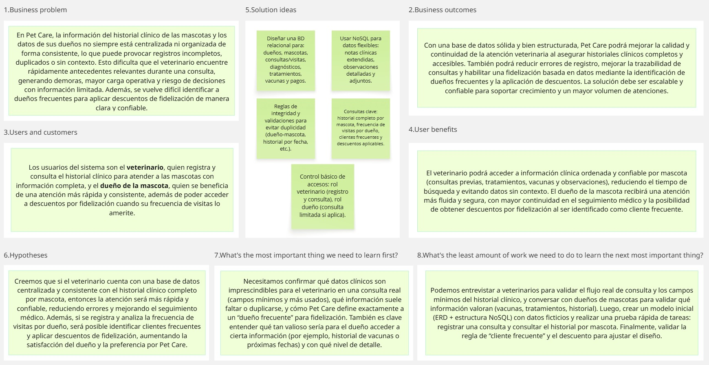

# UNIVERSIDAD PERUANA DE CIENCIAS APLICADAS

***Ingeniería de Software | Ingeniería de Sistemas de información | Ciencias de la computación***

---

<strong>Curso:</strong> Diseño de Base de Datos

<strong>NRC:</strong> 388

<strong>Ciclo</strong> 4

<strong>Docente:</strong> Rafael Oswaldo Castro Veramendi

---

  

<h3>
<strong>Informe de trabajo: TB1</strong>
</h3>

#### *Relación de integrantes:*

| INTEGRANTES | CÓDIGO |
| :---: | :---: |
| Mitma Ayala, Cielo Anahí | U202420007 |
| Quispe Flores, Judith Xiomara | U202424896 |
| Riveros Vera, Jennifer Yamilet | U20241C998 |
| Tintayo Pujaico, Adriano Martín | U20241C201 |
| Vergaray Calderon, Rose Almendra | U20241D159 |

## REGISTRO DE VERSIONES DEL INFORME

| Versión | Fecha | Autor | Descripción de modificación |
| :---: | :---: | :---: | :---: |
| TB1 | 26/01/26 | - Mitma Ayala, Cielo Anahí - Quispe Flores, Judith Xiomara - Riveros Vera, Jennifer Yamilet - Tintayo Pujaico, Adriano Martín - Vergaray Calderon, Rose Almendra | CAPÍTULO 1: Introducción 1.1 Startup Profile 1.1.1 Descripción del startup 1.1.2 Perfiles de integrantes del equipo 1.2 Solution Profile 1.2.1 Antecedentes y Problemática 1.2.2 Propuesta de Valor 1.3 Segmento Objetivo  CAPÍTULO 2: Requeriments 2.1 Entrevistas 2.1.1 Diseño de entrevistas 2.1.2 Registro de entrevistas 2.1.3 Análisis de entrevistas 2.2 Requisitos |
| TP |
| TB2 |
| TF |

## TABLA DE CONTENIDOS

[REGISTRO DE VERSIONES DEL INFORME](#registro-de-versiones-del-informe)

[STUDENT OUTCOME](#student-outcome)

[CAPÍTULO 1: INTRODUCCIÓN](#capítulo-1-introducción)

- [1.1 Startup Profile](#11-startup-profile)

  - [1.1.1 Descripción del Startup](#111-descripción-del-startup)

  - [1.1.2 Perfiles de integrantes del equipo](#112-perfiles-de-integrantes-del-equipo)

- [1.2 Solution Profile](#12-solution-profile)

  - [1.2.1  Antecedentes y problemática](#121-antecedentes-y-problemática)

  - [1.2.2 Propuesta de valor](#122-propuesta-de-valor)

## STUDENT OUTCOME

| Criterio específico | Acciones realizadas | Conclusiones |
| :--- | :--- | :--- |
| Actualiza conceptos y conocimientos necesarios para su desarrollo profesional y en especial para su proyecto en soluciones de ingeniería de software. | *Mitma Ayala, Cielo Anahí*  TB1: Redaccion del Startup. Realización de una entrevista. Elaboración de 3 User Stories.  TP:  TB2:  TF:   *Quispe Flores, Judith Xiomara*  TB1: Desarrollo de la herramienta de gestión 5W y 2H. Realización de una entrevista. Elaboración de 3 User Stories.  TP:  TB2:  TF:   *Riveros Vera, Jennifer Yamilet*  TB1: Desarrollo de Lean UX Canvas para evidenciar la propuesta de valor. Realización de una entrevista. Elaboración de 3 User Stories  TP:  TB2:  TF:   *Tintayo Pujaico, Adriano Martín*  TB1: Descripción de los segmentos objetivos. Realización de una entrevista. Elaboración de 3 User Stories. TP:  TB2:  TF:   *Vergaray Calderon, Rose Almendra*  TB1: Elaboración del diseño de entrevistas. Redacción del análisis de entrevistas.  TP:  TB2:  TF:  | TB1:  - Se identificó el problema mediante entrevistas sobre la desactualización de inventario por ventas y la necesidad de seguimiento preventivo.  - Se evidenciaron problemas sobre el manejo de la información en algunas veterinarias, como la gestión eficiente de múltiples mascotas.  - Se reconocieron problemas acerca de la eficiencia y precisión en los registros historiales, lo cual perjudica la atención de la clínica. |
| Reconoce la necesidad del aprendizaje permanente para el desempeño profesional y el desarrollo de proyectos en soluciones de soluciones de ingeniería de software. | *Mitma Ayala, Cielo Anahí*  TB1:   TP:  TB2:  TF:   *Quispe Flores, Judith Xiomara*  TB1: .  TP:  TB2:  TF:   *Riveros Vera, Jennifer Yamilet*  TB1:   TP:  TB2:  TF:   *Tintayo Pujaico, Adriano Martín*  TB1:  TP:  TB2:  TF:   *Vergaray Calderon, Rose Almendra*  TB1:   TP:  TB2:  TF:  | TB1:   |

# CAPÍTULO 1: INTRODUCCIÓN

## 1.1 Startup Profile

### 1.1.1 Descripción del Startup

Somos DataSystem, un equipo conformado por estudiantes de la Universidad Peruana de Ciencias Aplicadas (UPC) de la rama de Informática, apasionados por la tecnología y comprometidos con el dominio y la gestión eficiente de grandes volúmenes de datos, con el objetivo de resolver problemas computacionales reales mediante soluciones bien estructuradas. Nuestra misión es desarrollar bases de datos relacionales y no relacionales sólidas, coherentes y confiables, que permitan a las empresas organizar su información de manera clara y segura, mientras que nuestra visión es consolidarnos como una empresa líder en la creación de bases de datos escalables para compañías de gran tamaño y alta demanda en el mercado. Nuestro proyecto principal está enfocado en la veterinaria Pet Care, una empresa de preferencia del público por su organización y calidad de atención, para la cual diseñamos una base de datos que gestiona de forma eficiente el historial clínico de las mascotas, la cartera de clientes, la frecuencia de visitas y consultas, permitiendo identificar clientes frecuentes y aplicar descuentos por fidelización. Gracias a esta solución, veterinarios y asistentes pueden acceder a la información médica de los pacientes de manera ordenada y confiable, evitando datos duplicados, inconsistencias o información sin contexto, lo que reduce el estrés operativo y mejora significativamente la atención médica.

### 1.1.2 Perfiles de integrantes del equipo

| Integrantes | Descripción |
| :--- | :--- |
| Mitma Ayala, Cielo Anahí | Mi nombre es Cielo Anahí Mitma Ayala (u202420007), estudiante de Ciencias de la Computación en la UPC. Cuento con certificaciones en Python y ordenamiento de datos, Scrum, además de conocimientos en HTML, CSS y JavaScript básicos, manejo de ordenamiento avanzado de datos, programación en C++ en consola y un nivel de inglés intermedio. Poseo una base sólida en lógica y matemáticas, lo que me permite destacar en la resolución de problemas informáticos. Me caracterizo por mi creatividad en la creación de proyectos tecnológicos y de negocio, cualidades que me permitirán un gran desarrollo frente a los desafíos que se presenten. |
| Quispe Flores, Judith Xiomara | Mi nombre es Judith Xiomara Quispe Flores (U202424896), estudiante de Ingeniería de Sistemas de Información en la UPC. Como futura profesional, cuento con una base sólida en pensamiento lógico, análisis matemático y fundamentos de programación, complementada con habilidades de comunicación y trabajo en equipo. Mi formación abarca también el manejo de datos y la gestión de proyectos tecnológicos, siempre orientados a optimizar procesos y apoyar la toma de decisiones. Me caracterizo por mi capacidad de adaptación, creatividad para resolver problemas y un compromiso ético en la búsqueda de soluciones innovadoras. |
| Riveros Vera, Jennifer Yamilet | Mi nombre es Jennifer Yamilet Riveros Vera (u20241c998). Estoy cursando la carrera de Ingeniería de Software en la UPC con interés en ser una futura desarrolladora backend. Estoy certificada en la Universidad de California San Diego, desarrollando fundamentos en Java, y también tengo conocimientos en inglés intermedio y en Excel, lo que me permite tener una perspectiva integral y preparada para los próximos proyectos que vengan. |
| Tintayo Pujaico, Adriano Martín | Mi nombre es Adriano Martín Isaías Tintayo Pujaico (u20241c201). Soy estudiante de la carrera de Ingeniería de Sistemas de Información en la Universidad Peruana de Ciencias Aplicadas (UPC). Cuento con conocimientos básicos en C++ y Python. Como estudiante universitario poseo la capacidad de resolución de problemas, pensamiento crítico y orientación a resultados, además de una rápida adaptación a nuevas tecnologías. |
| Vergaray Calderon, Rose Almendra | Mi nombre es Rose Almendra Vergaray Calderon (u20241d159). Soy estudiante de la carrera de Ingeniería de Software en la Universidad Peruana de Ciencias Aplicadas (UPC). Cuento con conocimientos básicos en Python, HTML, Java, y programación en C++ nivel intermedio, lo que me ha ayudado a desarrollar un enfoque orientado a la innovación y a la optimización de procesos mediante el uso de nuevas tecnologías. Me motiva estar en constante aprendizaje, explorar nuevas herramientas y enfrentar proyectos que pongan a prueba mis habilidades. |

## 1.2 Solution Profile

### 1.2.1 Antecedentes y problemática

- ***¿Cuál es el problema? / ¿Qué?***  
La gestión de información en la veterinaria Pet Care es desorganizada y dispersa, lo que provoca repetición de datos, falta de coherencia en los registros médicos de los animales y complicaciones para acceder a la información relevante de forma inmediata. Esto afecta tanto a la atención como a la administración de clientes y promociones. Además, no hay sistema que facilite la identificación y recompensa a los clientes más frecuentes, lo que limita la posibilidad de fomentar la lealtad y personalizar el servicio.

- ***¿Cuándo y cuánto?***  
Este es un inconveniente habitual que se evidencia diariamente durante la atención de mascotas, sobre todo en horas de mayor actividad. La falta de un sistema centralizado ocasiona un desperdicio de tiempo en búsqueda y validación de datos, así como el riesgo de tomar decisiones clínicas basadas en datos que no están completos o desactualizados. Desde un punto de vista operativo, se estima que el personal invierte hasta un tercio de su tiempo en tareas administrativas repetitivas en vez de centrarse en la atención médica.

- ***¿Dónde?***  
La problemática se presenta especialmente en la veterinaria Pet Care, tanto en su sede física como en los registros digitales que emplean actualmente, como hojas de cálculo, documentos no relacionados y documentación impresa.

- ***¿Quiénes?***
Afecta de manera directa al personal de la veterinaria: veterinarios, asistentes y personal administrativo, quienes deben lidiar con la desorganización de la información. También impacta en los clientes, quienes pueden sufrir retrasos en su atención, falta de seguimiento en el historial de sus mascotas y pérdida de oportunidades de descuentos o beneficios por lealtad.

- ***¿Por qué y cómo?***  
Esto se debe a la falta de un sistema integrado de base de datos que unifique y conecte los datos de mascotas, dueños, citas, tratamientos y promociones. Actualmente, la información se gestiona en formatos aislados y no estructurados, lo que dificulta su consulta, modificación y análisis. Como resultado, se producen fallos en las operaciones, se limita la capacidad de tomar decisiones basadas en datos y se reduce la calidad del servicio al cliente y la mascota.

### 1.2.2 Propuesta de valor

A continuación, presentaremos un Lean UX Canvas para la realización de esta sección.

