# UNIVERSIDAD PERUANA DE CIENCIAS APLICADAS

***Ingeniería de Software | Ingeniería de Sistemas de información | Ciencias de la computación***

**Curso:** Diseño de Base de Datos  
**NRC:** 388  
**Ciclo:** 4  
**Docente:** Rafael Oswaldo Castro Veramendi

  

### **Informe de trabajo: TB1**

***Relación de integrantes:***

| INTEGRANTES | CÓDIGO |
| :---: | :---: |
| Mitma Ayala, Cielo Anahí | U202420007 |
| Quispe Flores, Judith Xiomara | U202424896 |
| Riveros Vera, Jennifer Yamilet  | U20241c998 |
| Tintayo Pujaico, Adriano Martín | U20241C201 |
| Vergaray Calderon, Rose Almendra | U20241D159 |

Febrero, 2026

<div style="page-break-after: always"></div>

## REGISTRO DE VERSIONES DEL INFORME

**Tabla 1**

*Registro de versiones del informe*

| Versión | Fecha | Autor | Descripción de modificación |
| :---: | :---: | :---: | :---: |
| TB1 | 26/01/26 | - Mitma Ayala, Cielo Anahí<br>- Quispe Flores, Judith Xiomara<br>- Riveros Vera, Jennifer Yamilet<br>- Tintayo Pujaico, Adriano Martín<br>- Vergaray Calderon, Rose Almendra | CAPÍTULO I: Introducción<br>1.1 Startup Profile<br>1.1.1 Descripción del startup<br>1.1.2 Perfiles de integrantes del equipo<br>1.2 Solution Profile<br>1.2.1 Antecedentes y Problemática<br>1.2.2 Propuesta de Valor<br>1.3 Segmento Objetivo<br><br>CAPÍTULO II: Requeriments<br>2.1 Entrevistas<br>2.1.1 Diseño de entrevistas<br>2.1.2 Registro de entrevistas<br>2.1.3 Análisis de entrevistas<br>2.2 Requisitos |
| TP | 04/02/26 |  Mitma Ayala, Cielo Anahí<br>- Quispe Flores, Judith Xiomara<br>- Riveros Vera, Jennifer Yamilet<br>- Tintayo Pujaico, Adriano Martín<br>- Vergaray Calderon, Rose Almendra | CAPÍTULO III: Diseño de base de datos<br>3.1 Entidades<br>3.2 Atributos<br>3.3 Enfoque relacional<br>3.3.1 Diagrama entidad-relación lógico<br><br>CAPÍTULO IV: Implementación de base de datos<br>4.1 Sistema de gestión de base de datos<br>4.1.1 Evaluación y elección del sistema de gestión de base de datos relacional<br>4.2 Diagramas de datos<br>4.2.1 Diagrama entidad-relación físico |
| TB2 | 17/02/26 | Mitma Ayala, Cielo Anahí<br>- Quispe Flores, Judith Xiomara<br>- Riveros Vera, Jennifer Yamilet<br>- Tintayo Pujaico, Adriano Martín<br>- Vergaray Calderon, Rose Almendra | CAPÍTULO IV: Implementación de base de datos<br>4.3 Scripts de la base de datos<br>4.3.1 Scripts de creación y carga de datos de la base de datos relacional<br>4.4 Consultas<br>4.4.1 Consultas para la datos de la base de datos relacional |
| TF | | | |

<div style="page-break-after: always"></div>

## TABLA DE CONTENIDOS

[REGISTRO DE VERSIONES DEL INFORME](#registro-de-versiones-del-informe)

[STUDENT OUTCOME](#student-outcome)

[CAPÍTULO I: INTRODUCCIÓN](#capítulo-i-introducción)

- [1.1 Startup Profile](#11-startup-profile)

  - [1.1.1 Descripción del Startup](#111-descripción-del-startup)

  - [1.1.2 Perfiles de integrantes del equipo](#112-perfiles-de-integrantes-del-equipo)

- [1.2 Solution Profile](#12-solution-profile)

  - [1.2.1  Antecedentes y problemática](#121-antecedentes-y-problemática)

  - [1.2.2 Propuesta de valor](#122-propuesta-de-valor)

- [1.3 Segmentos objetivo](#13-segmentos-objetivo)

[CAPÍTULO II: RECOPILACIÓN Y ANÁLISIS DE REQUISITOS](#capítulo-ii-recopilación-y-análisis-de-requisitos)

- [2.1 Entrevistas](#21-entrevistas)

  - [2.1.1 Diseño de entrevistas](#211-diseño-de-entrevistas)

  - [2.1.2 Registro de entrevistas](#212-registro-de-entrevistas)

  - [2.1.3 Análisis de entrevistas](#213-análisis-de-entrevistas)

- [2.2 Requisitos](#22-requisitos)

  - [2.2.1 Funcionales](#221-funcionales)
 
  - [2.2.2 No funcionales](#222-no-funcionales)

[CAPÍTULO III: DISEÑO DE BASE DE DATOS](#capítulo-iii-diseño-de-base-de-datos)

- [3.1 Entidades](#31-entidades)

- [3.2 Atributos](#32-atributos)

- [3.3 Enfoque relacional](#33-enfoque-relacional)

  - [3.3.1 Diagrama entidad-relación lógico](#331-diagrama-entidad-relación-lógico)

  - [3.3.2 Justificación del modelo entidad-relación lógico](#332-justificación-del-modelo-entidad-relación-lógico)

[CAPÍTULO IV: IMPLEMENTACIÓN DE LA BASE DE DATOS](#capítulo-iv-implementación-de-la-base-de-datos)

- [4.1 Sistema de gestión de base de datos](#41-sistema-de-gestión-de-base-de-datos)

  - [4.1.1 Evaluación y elección del sistema de gestión de base de datos relacional](#411-evaluación-y-elección-del-sistema-de-gestión-de-base-de-datos-relacional)

- [4.2 Diagrama de datos](#42-diagrama-de-datos)

  - [4.2.1 Diagrama entidad-relación físico](#421-diagrama-entidadrelación-físico)

- [4.3 Scripts de la base de datos](#43-scripts-de-la-base-de-datos)

  - [4.3.1 Scripts de creación y carga de datos de la base de datos relacional](#431-scripts-de-creación-y-carga-de-datos-de-la-base-de-datos-relacional)

- [4.4 Consultas](#44-consultas)

  - [4.4.1 Consultas para la datos de la base de datos relacional](#441-consultas-para-la-base-de-datos-relacional)

[BIBLIOGRAFÍA](#bibliografía)

[ANEXOS](#anexos)

<div style="page-break-after: always"></div>

## STUDENT OUTCOME

**Tabla 2**

*Student outcome del equipo*

---

## Criterio específico
**Actualiza conceptos y conocimientos necesarios para su desarrollo profesional y en especial para su proyecto en soluciones de ingeniería de software.**

### Acciones realizadas

- **Mitma Ayala, Cielo Anahí**
  - **TB1:**
    - Proyección del equipo frente al proyecto de dominio de datos a gran escala.
  - **TP1:**
    - Colaboró en la identificación y descripción de entidades.
    - Participó en la definición de atributos asociados a cada entidad.

- **Quispe Flores, Judith Xiomara**
  - **TB1:**
    - Desarrollo de la herramienta de gestión 5W y 2H.
    - Realice una entrevista al dueño de una mascota.
    - Realice 3 User Stories.
  - **TP1:**
    - Realizó el diagrama entidad-relación lógico y su código SQL.
  - **TB2:**
    - Agregue información en la base de datos.
    - Desarrolle 3 consultas y un procedimiento.

- **Riveros Vera, Jennifer Yamilet**
  - **TB1:**
    - Desarrollo de Lean UX Canvas para evidenciar la propuesta de valor centrada al usuario.
    - Realización de una entrevista sobre el registro historial veterinario.
    - Realización de 3 User Stories.
  - **TP1:**
    - Realización de corrección de errores en requisitos y creación de no funcionales.
    - Creación de diagrama .erd de entidad-relación lógica y código sql.
  - **TB2:**
    - Realizacion de la carga de datos
    - Desarrollo de consulta

- **Tintayo Pujaico, Adriano Martín**
  - **TB1:**
    - Delimitación y descripción de los segmentos objetivos.
    - Realización de una entrevista a dueño de clínica veterinaria.
    - Elaboración de 3 User Stories.
  - **TP1:**
    - Realización de la evaluación y elección del sistema de gestión de base de datos relacional sobre el proyecto.

- **Vergaray Calderon, Rose Almendra**
  - **TB1:**
    - Elaboración del diseño de entrevistas.
    - Redacción del análisis de entrevistas.
  - **TP1:**
    - Participó en la identificación y definición de entidades del dominio del problema.
    - Definió los atributos de cada entidad.

### Conclusiones

- **TB1:**
  - Se identificó el problema mediante entrevistas sobre la desactualización de inventario por ventas y la necesidad de seguimiento preventivo.
  - Se evidenciaron problemas sobre el manejo de la información en algunas veterinarias, como la gestión eficiente de múltiples mascotas.
  - Se reconocieron problemas acerca de eficiencia y precisión en los registros historiales, lo cual perjudica la atención de la clínica.
- **TP1:**
  - En esta etapa el equipo aplicó fundamentos de modelado de datos al identificar entidades y atributos. Asimismo, se utilizaron principios del enfoque relacional para construir el diagrama entidad-relación lógico y posteriormente el modelo físico, vinculando el diseño conceptual con la implementación.
- **TB2:**
  - Durante la implementación de la base de datos apliqué creacion de base de datos y tablas y ejecute consultas con JOIN y agregacion para obtener informacion util al sistema.

---

## Criterio específico
**Reconoce la necesidad del aprendizaje permanente para el desempeño profesional y el desarrollo de proyectos en soluciones de ingeniería de software.**

### Acciones realizadas

- **Mitma Ayala, Cielo Anahí**
  - **TB1:**
    - Apliqué lo aprendido en otro curso para el desarrollo de los user stories y en que se basa la descripción de la startup.
  - **TP1:**
    - Reconoció la importancia de profundizar en el modelado conceptual de bases de datos.

- **Quispe Flores, Judith Xiomara**
  - **TB1:**
    - Conocimiento adquirido de otros cursos, como el uso de User Stories y la herramienta 5W y 2H.
  - **TP1:**
    - A través del diseño e implementación del diagrama entidad-relación para el sistema, reconocí necesidad de aprender nuevas técnicas de modelación de datos y herramientas con ERD Editor.
  - **TB2:**
    - Logré implementar consultas que responden a necesidades reales y también desarrollé un procedimiento almacenado que genera recordatorios automáticos de vacunas próximas a vencer.

- **Riveros Vera, Jennifer Yamilet**
  - **TB1:**
    - Se hizo revisión a la redacción de las User Stories y saber sus necesidades mediante entrevista.
    - Aplicar feedback y ciclo de mejora mediante los requisitos.
  - **TP1:**
    - Superé desafíos técnicos de organización en Visual Studio liderando en la clarificación de esos problemas, además de que desarrollé un diagrama DER.

  - **TB2:**
    - Logre desarrollar consultas a problemas cotidianos en respecto a nuestro sistema como contacto de emergencia, total de citas e historial de datos.

- **Tintayo Pujaico, Adriano Martín**
  - **TB1:**
    - Definición de los tipos de segmentos objetivos para la realización del proyecto.
  - **TP1:**
    - Evaluación y elección del sistema de gestión de base de datos relacional sobre el proyecto.

- **Vergaray Calderon, Rose Almendra**
  - **TB1:**
    - Integración de los hallazgos de entrevistas en análisis.
  - **TP1:**
    - Reconoció la necesidad de fortalecer sus conocimientos en modelado de datos, especialmente en la correcta definición de entidades y atributos.
    - Identificó el diseño de bases de datos como área de crecimiento profesional.

### Conclusiones

- **TB1:**
  - En la entrevista se demostró que validar con los usuarios reduce trabajo y que el trabajo requiere aprendizaje continuo por casos reales que no se resuelven fácilmente con supuestos, como en la entrevista con el Dr. Irwin con el problema del inventario por unidades y el control preventivo.
  - La entrevista evidencia dificultades en el manejo de la información veterinaria. Esto refuerza la importancia del aprendizaje continuo en ingeniería de software, ya que solo a través de la evolución continua de los requisitos y el dominio del usuario podremos crear una solución completa que resuelva estos problemas de forma eficaz y confiable.
  - La entrevista demostró la importancia de buscar casos reales de los cuales recopilar información y conseguir puntos más precisos para nuestro proyecto, como en la entrevista con la Dra. Marisol demuestra los problemas al momento de manejar historiales y guardar información.
- **TP1:**
  - Se fortaleció mi capacidad para modelar datos de manera lógica y colaborativa, aplicando conocimientos previos y aprendiendo nuevas herramientas que, junto al compromiso constante del equipo, nos permitieron estructurar una base de datos alineada con los requisitos del proyecto.
  - Mi participación en el proyecto afirmó mi aprendizaje en el modelado de diagrama lógico, adaptar mis conocimientos y una solución de organización que permitió al grupo poder hacerlo bien con el apoyo de todos al querer aportar con algo en el trabajo. Esto concluye por exitoso que no solo preside código sino que la disposición constante del grupo a aprender cosas nuevas.
- **TB2:**
  - Para completar la implementación tuve que aprender a resolver problemas de ejecución con conexion a SQLEXPRESS, esto permitio a reconocer la importancia del aprendizaje continuo para adaptarme a herramientas por la verificacion de resultados.


<div style="page-break-after: always"></div>

# CAPÍTULO I: INTRODUCCIÓN

## 1.1 Startup Profile

### 1.1.1 Descripción del Startup

Somos DataSystem, un equipo conformado por estudiantes de la Universidad Peruana de Ciencias Aplicadas (UPC) de la rama de Informática, apasionados por la tecnología y comprometidos con el dominio y la gestión eficiente de grandes volúmenes de datos, con el objetivo de resolver problemas computacionales reales mediante soluciones bien estructuradas. Nuestra misión es desarrollar bases de datos relacionales y no relacionales sólidas, coherentes y confiables, que permitan a las empresas organizar su información de manera clara y segura, mientras que nuestra visión es consolidarnos como una empresa líder en la creación de bases de datos escalables para compañías de gran tamaño y alta demanda en el mercado. Nuestro proyecto principal está enfocado en la veterinaria Pet Care, una empresa de preferencia del público por su organización y calidad de atención, para la cual diseñamos una base de datos que gestiona de forma eficiente el historial clínico de las mascotas, la cartera de clientes, la frecuencia de visitas y consultas, permitiendo identificar clientes frecuentes y aplicar descuentos por fidelización. Gracias a esta solución, veterinarios y asistentes pueden acceder a la información médica de los pacientes de manera ordenada y confiable, evitando datos duplicados, inconsistencias o información sin contexto, lo que reduce el estrés operativo y mejora significativamente la atención médica.

### 1.1.2 Perfiles de integrantes del equipo

**Tabla 3**

*Perfiles de integrantes del equipo*

| Integrantes | Descripción |
| :--- | :--- |
|  | Mi nombre es Cielo Anahí Mitma Ayala (u202420007), estudiante de Ciencias de la Computación en la UPC. Cuento con certificaciones en Python y ordenamiento de datos, Scrum, además de conocimientos en HTML, CSS y JavaScript básicos, manejo de ordenamiento avanzado de datos, programación en C++ en consola y un nivel de inglés intermedio. Poseo una base sólida en lógica y matemáticas, lo que me permite destacar en la resolución de problemas informáticos. Me caracterizo por mi creatividad en la creación de proyectos tecnológicos y de negocio, cualidades que me permitirán un gran desarrollo frente a los desafíos que se presenten. |
|  | Mi nombre es Judith Xiomara Quispe Flores (U202424896), estudiante de Ingeniería de Sistemas de Información en la UPC. Como futura profesional, cuento con una base sólida en pensamiento lógico, análisis matemático y fundamentos de programación, complementada con habilidades de comunicación y trabajo en equipo. Mi formación abarca también el manejo de datos y la gestión de proyectos tecnológicos, siempre orientados a optimizar procesos y apoyar la toma de decisiones. Me caracterizo por mi capacidad de adaptación, creatividad para resolver problemas y un compromiso ético en la búsqueda de soluciones innovadoras. |
|  | Mi nombre es Jennifer Yamilet Riveros Vera (u20241c998). Estoy cursando la carrera de Ingeniería de Software en la UPC con interés en ser una futura desarrolladora backend. Estoy certificada en la Universidad de California San Diego, desarrollando fundamentos en Java, y también tengo conocimientos en inglés intermedio y en Excel, lo que me permite tener una perspectiva integral y preparada para los próximos proyectos que vengan. |
|  | Mi nombre es Adriano Martín Isaías Tintayo Pujaico (u20241c201). Soy estudiante de la carrera de Ingeniería de Sistemas de Información en la Universidad Peruana de Ciencias Aplicadas (UPC). Cuento con conocimientos básicos en C++ y Python. Como estudiante universitario poseo la capacidad de resolución de problemas, pensamiento crítico y orientación a resultados, además de una rápida adaptación a nuevas tecnologías. |
|  | Mi nombre es Rose Almendra Vergaray Calderon (u20241d159). Soy estudiante de la carrera de Ingeniería de Software en la Universidad Peruana de Ciencias Aplicadas (UPC). Cuento con conocimientos básicos en Python, HTML, Java, y programación en C++ nivel intermedio, lo que me ha ayudado a desarrollar un enfoque orientado a la innovación y a la optimización de procesos mediante el uso de nuevas tecnologías. Me motiva estar en constante aprendizaje, explorar nuevas herramientas y enfrentar proyectos que pongan a prueba mis habilidades. |

## 1.2 Solution Profile

### 1.2.1 Antecedentes y problemática

- ***¿Cuál es el problema? / ¿Qué?***  
La gestión de información en la veterinaria Pet Care es desorganizada y dispersa, lo que provoca repetición de datos, falta de coherencia en los registros médicos de los animales y complicaciones para acceder a la información relevante de forma inmediata. Esto afecta tanto a la atención como a la administración de clientes y promociones. Además, no hay sistema que facilite la identificación y recompensa a los clientes más frecuentes, lo que limita la posibilidad de fomentar la lealtad y personalizar el servicio.

- ***¿Cuándo y cuánto?***  
Este es un inconveniente habitual que se evidencia diariamente durante la atención de mascotas, sobre todo en horas de mayor actividad. La falta de un sistema centralizado ocasiona un desperdicio de tiempo en búsqueda y validación de datos, así como el riesgo de tomar decisiones clínicas basadas en datos que no están completos o desactualizados. Desde un punto de vista operativo, se estima que el personal invierte hasta un tercio de su tiempo en tareas administrativas repetitivas en vez de centrarse en la atención médica.

- ***¿Dónde?***  
La problemática se presenta especialmente en la veterinaria Pet Care, tanto en su sede física como en los registros digitales que emplean actualmente, como hojas de cálculo, documentos no relacionados y documentación impresa.

- ***¿Quiénes?***
Afecta de manera directa al personal de la veterinaria: veterinarios, asistentes y personal administrativo, quienes deben lidiar con la desorganización de la información. También impacta en los clientes, quienes pueden sufrir retrasos en su atención, falta de seguimiento en el historial de sus mascotas y pérdida de oportunidades de descuentos o beneficios por lealtad.

- ***¿Por qué y cómo?***  
Esto se debe a la falta de un sistema integrado de base de datos que unifique y conecte los datos de mascotas, dueños, citas, tratamientos y promociones. Actualmente, la información se gestiona en formatos aislados y no estructurados, lo que dificulta su consulta, modificación y análisis. Como resultado, se producen fallos en las operaciones, se limita la capacidad de tomar decisiones basadas en datos y se reduce la calidad del servicio al cliente y la mascota.

### 1.2.2 Propuesta de valor

A continuación, presentaremos un Lean UX Canvas para la realización de esta sección.

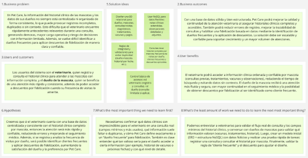

El Lean UX Canvas de DataSystem para Pet Care resume que el problema principal es la falta de centralización y consistencia en el historial clínico de las mascotas y los datos de sus dueños, lo que genera registros duplicados o incompletos y dificulta que el veterinario acceda rápido a información con contexto durante una consulta. Como usuarios se consideran únicamente el veterinario (quien registra y consulta la información médica) y el dueño de la mascota (beneficiario de una atención más ágil y confiable). Los resultados esperados del negocio son mejorar la continuidad y calidad de la atención, reducir errores de registro y habilitar fidelización mediante la identificación de dueños frecuentes y descuentos. La solución propuesta consiste en diseñar una base de datos híbrida (relacional para datos estructurados como dueños, mascotas, consultas y vacunas; y NoSQL para notas clínicas flexibles).

## 1.3 Segmentos objetivo

PetCare se orienta a dos segmentos relacionados con dominio del problema: Dueños de Clínica Veterinaria y Dueños de Mascotas. Ambos segmentos consumen grandes cantidades de información clínica y administrativa, lo que evidencia la necesidad de una base de datos estructurada.

***Dueño de Clínica Veterinaria:***  

Este segmento está conformado por dueños y administradores de clínicas veterinarias localizadas en Lima Metropolitana, mayoritariamente ubicado en distritos con alta densidad poblacional y alta demanda de servicios veterinarios.

Según un artículo especializado, aproximadamente el 60% de MyPEs peruanas aún depende de procesos manuales y poco eficientes, lo cual limita su crecimiento y competitividad en un entorno cada vez más digitalizado (Gadgerss, 2025). Esta situación muestra las brechas tecnológicas que existen entre las clínicas veterinarias que aún no se han adaptado a sistemas integrados de información, lo cual requiere la implementación de una base de datos estructurada.

***Dueños de Mascotas:***

Este segmento está conformado por personas residentes en Lima Metropolitana que poseen mascotas, mayormente perros y gatos, y que asisten a clínicas veterinarias para controles o tratamientos médicos.

Según un estudio de Kantar, casi el 50% de hogares peruanos cuenta con al menos una mascota, siendo Lima Metropolitana una de las zonas con mayor concentración de animales de compañía (Kantar, 2019). Este nivel de tenencia de mascotas genera una demanda continua de servicios veterinarios y, por tanto, la necesidad de gestionar grandes volúmenes de información clínica de manera estructurada.

<div style="page-break-after: always"></div>

# CAPÍTULO II: RECOPILACIÓN Y ANÁLISIS DE REQUISITOS

## 2.1 Entrevistas

### 2.1.1 Diseño de entrevistas

***Para los arquetipos:***

1. ¿Cuál es tu nombre completo?  
2. ¿Cuál es tu edad?  
3. ¿Cuál es tu ocupación?  
4. ¿Distrito en donde reside?  
5. ¿Cuál es tu nivel socioeconómico (Alto, medio-alto, bajo)?  

***Para los arquetipos (Dueños de veterinarias):***

1. ¿Cuántos años lleva operando su veterinaria?  
2. ¿Podría describir cómo registran actualmente la información de las mascotas y de sus dueños en su veterinaria?  
3. ¿Cada mascota tiene su propio historial clínico? ¿Cómo se identifica o diferencia cada historial?  
4. ¿Qué tipo de información considera indispensable tener disponible y organizada durante una consulta veterinaria?  
5. ¿Ha tenido problemas relacionados con registros duplicados, incompletos o desactualizados? ¿Podría contar algún caso?  
6. Desde su experiencia, ¿qué tipo de errores considera más frecuentes en el registro de información clínica de las mascotas?  
7. Si existiera una herramienta tecnológica que centralice y estructure esta información, ¿cree que mejoraría la continuidad y calidad de la atención? ¿por qué?  

***Para los arquetipos (Dueños de mascotas):***

1. ¿Con qué frecuencia lleva a su mascota a la veterinaria y por qué motivos principalmente?  
2. ¿Generalmente acude a la misma veterinaria para la atención de su mascota o ha tenido que acudir a otra en alguna ocasión? ¿Cuáles fueron los motivos del cambio?  
3. ¿Alguna vez le han pedido repetir información sobre su mascota en una consulta? ¿En qué situación ocurrió?  
4. ¿Qué tan importante es para usted que el veterinario tenga acceso rápido al historial clínico de su mascota durante la consulta?  
5. ¿Ha tenido más de una mascota atendida en la misma veterinaria? Si así fue, ¿cómo fue esa experiencia respecto a la organización de la información de sus mascotas?  
6. ¿Qué tipo de información le gustaría consultar directamente desde una plataforma o aplicación sobre la atención de su mascota?  
7. ¿Cree que una mejor organización de la información clínica mejora la atención que recibe su mascota? ¿Por qué?  

### 2.1.2 Registro de entrevistas

**Tabla 4**

*Registro de la entrevista 1 - Segmento objetivo 1*

| Segmento #1 | Entrevista #1 |
| --- | --- |
| Nombre completo | Marisol Sequeiros |
| Edad | 47 |
| Distrito | Villa El Salvador |
| Ocupación | Médico Veterinario |
| Inicio y duración | 00:00 - 10:05 |
| Enlace | [Entrevista#1](https://upcedupe-my.sharepoint.com/:v:/g/personal/u20241c201_upc_edu_pe/IQC6IzB_vTO6SrUgnXXmLQ4HAeTPB1Yi0RFPsskqM_6gEDM?e=EAjD1d) |
| Resumen | Dra. Marisol nos comenta que principalmente utiliza registros físicos y algunos archivos Excel, los seguimientos de los historiales se hacen manualmente lo cual no es preciso ni eficiente, además contando con problemas tales como: duplicidad de registros de una misma mascota, datos incompletos e información desactualizada. |
| Foto |  |

**Tabla 5**

*Registro de la entrevista 2 - Segmento objetivo 1*

| Segmento #1 | Entrevista #2 |
| --- | --- |
| Nombre completo | Irwin Flores |
| Edad | 35 |
| Distrito | Cedros de Villa |
| Ocupación | Médico Veterinario |
| Inicio y duración | 00:00 - 2:00 |
| Enlace | [Entrevista#2](https://upcedupe-my.sharepoint.com/:v:/g/personal/u20241c998_upc_edu_pe/IQBSltkhD0s3QKuu9i94arxaAdYkz2QASR5Beub957yt0Ck?e=Q8B2fl) |
| Resumen | Dr. Irwin utiliza un sistema Vetpraxis, menciona que tiene un problema de inventario por que a veces llevar la cuenta exacta porque a veces se desactualiza en el sistema, porque a veces lo venden por varias cantidades de pastillas. |
| Foto | 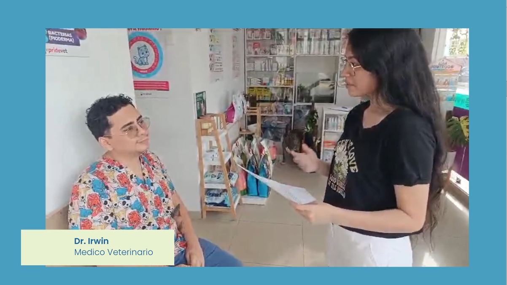  |

**Tabla 6**

*Registro de la entrevista 3 - Segmento objetivo 2*

| Segmento #2 | Entrevista #3 |
| --- | --- |
| Nombre completo | Diego Alhuay Espino |
| Edad | 19 |
| Distrito | Surco |
| Ocupación | Estudiante universitario de la carrera de Ingeniería de Sistemas |
| Inicio y duración | 00:00 - 10:02 |
| Enlace | [Entrevista#3](https://youtu.be/IFqXw6di1-M?si=rLDN6Omv5FypVZ13) |
| Resumen | Diego es estudiante universitario y dueño de un perro de 3 años. Lleva a su mascota al veterinario cada dos meses para baños y control de vacunas y salud. No ha cambiado de veterinaria con su mascota actual, aunque sí lo hizo antes por motivos de distancia. Señala que, en general, el historial clínico de su mascota está registrado, pero en una ocasión le repitieron una pregunta sobre una vacuna ya aplicada, lo que le generó incomodidad y fastidio. Considera muy importante contar con un registro ordenado y completo del historial clínico. Le gustaría poder consultar los chequeos y vacunas pendientes mediante una página web o recibir recordatorios por parte de la veterinaria. |
| Foto |   |

**Tabla 7**

*Registro de la entrevista 4 - Segmento objetivo 2*

| Segmento #2 | Entrevista #4 |
| --- | --- |
| Nombre completo | Katia Quispe |
| Edad | 22 |
| Distrito | Villa María del Triunfo |
| Ocupación | Estudiante de Psicología |
| Inicio y duración | 00:00 - 4:12 |
| Enlace | [Entrevista#4](https://upcedupe-my.sharepoint.com/:v:/g/personal/u20211d455_upc_edu_pe/IQBifPq69VPpQbeH7F0fSJB2AWNYwCTIaq5_O-xnoljN57Y?e=NEAsGa&nav=eyJyZWZlcnJhbEluZm8iOnsicmVmZXJyYWxBcHAiOiJTdHJlYW1XZWJBcHAiLCJyZWZlcnJhbFZpZXciOiJTaGFyZURpYWxvZy1MaW5rIiwicmVmZXJyYWxBcHBQbGF0Zm9ybSI6IldlYiIsInJlZmVycmFsTW9kZSI6InZpZXcifX0%3D) |
| Resumen | Katia nos comenta que lleva a su mascota a la veterinaria entre 2 a 4 veces al año para controles, vacunas y emergencias. Cambio de clínica por horarios, urgencias o porque la habitual estaba cerrada, y en esos casos siempre tenía que repetir la información de su mascota, algo que se complica cuando lleva a más de una y puede generar confusión o errores. Por eso, considera fundamental tener la historia clínica bien organizada y accesible, ya que ahorra tiempo, da tranquilidad y mejora la atención. Le gustaría poder consultar en línea diagnósticos, vacunas y tratamientos, y recibir recordatorios de próximas citas. |
| Foto |   |

### 2.1.3 Análisis de entrevistas

#### Segmento #1 (Dueño de clínica veterinaria)

***Características objetivas del segmento***

El 100% de los entrevistados indicó que cada mascota cuenta con un historial clínico propio, asociado tanto a los datos del propietario como a los datos de la mascota.

Respecto a la forma de registro de información:  

- El 50% utiliza principalmente registros físicos y Excel, con manejo manual de la información.  
- El 50% utiliza un sistema digital (Vetpraxis) para organizar datos.

En relación con la información indispensable durante una consulta, el 100% de los entrevistados mencionó la necesidad de contar con: datos del dueño, datos generales de la mascota, historial de vacunas, tratamientos o servicios previos. Además, el 50% resaltó explícitamente la importancia de contar con fechas de desparasitaciones, vacunas y servicios periódicos para realizar recordatorios a los dueños.

Respecto a problemas en la gestión de información, el 100% de los entrevistados reportó problemas en la gestión de datos:  

- Entrevista 1 (50%) — Gestión manual:
  - Duplicidad de información, nombres de mascotas repetidos o parecidos que generan confusión  
  - Datos incompletos  
  - Información desactualizada  
  - Cruce de información entre turnos de médicos  
  - Retrasos de la atención

- Entrevista 2 (50%) — Sistema digital:
  - Desactualización del sistema
  - Problemas de control de inventario (cantidades variables de medicamentos)

***Características subjetivas del segmento***

Desde la experiencia del usuario:

- 50% describe el proceso actual como tedioso y lento.
- 100% considera que una herramienta que centralice la información mejoraría la calidad y continuidad de la atención.

Se evidencia la necesidad de:

- Acceso rápido a historiales clínicos.
- Mejor control de tratamientos.
- Mejor organización entre turnos de trabajo.

#### Segmento #2 (Dueño de mascota)

***Características objetivas del segmento***

El 100% de los entrevistados indicó que lleva a su mascota a controles veterinarios de manera periódica, ya sea por vacunas, chequeos, enfermedades o emergencias.

- El 50% lleva a su mascota aproximadamente cada 2 meses.
- El 50% asiste entre 2 y 4 veces al año.

El 100% indicó que normalmente acude a la misma veterinaria, sin embargo, también mencionaron que han tenido que asistir a otras veterinarias en algún momento por urgencias, distancia o disponibilidad de atención.

Respecto al manejo de la información clínica de su mascota, el 100% indicó que ha tenido que volver a proporcionar datos de su mascota en distintas consultas:

- El 50% reportó pérdida de información por depender de carnets físicos.
- El 50% señaló confusión o mezcla de información cuando se trata de la atención de más de una mascota en la misma veterinaria.

El 100% manifestó interés en poder acceder digitalmente a:

- Datos generales de la mascota
- Historial de vacunas
- Enfermedades previas
- Tratamientos realizados
- Resultados de exámenes
- Fechas de atención
- Próximas citas
- Recordatorios de vacunas o controles

Respecto a problemas relacionados con la gestión de la información, el 100% de los entrevistados ha experimentado:

- Entrevista 1 (50%):
  - Repetición constante de datos
  - Dependencia de registros físicos
  - Riesgo de pérdida del historial
  - Falta de recordatorios

- Entrevista 2 (50%)
  - Información no disponible en otras veterinarias
  - Confusión cuando existen varias mascotas
  - Falta de acceso directo al historial

***Características subjetivas del segmento***

Desde la experiencia del usuario:

- El 100% considera muy importante que el veterinario tenga acceso inmediato al historial clínico.
- El 100% opinan que una plataforma digital facilitaría tener un control sobre la salud de sus mascotas.

## 2.2 Requisitos

A base de las entrevistas a dueños de mascotas y dueños de clínicas veterinarias, se redactó las user stories principales.

### 2.2.1 Funcionales
**Tabla 8**  
*Historias de usuario del módulo de historial clínico y perfiles de mascota*

**Grupo Funcional: Historial clínico y perfiles de mascota**
| User Story ID | Descripción | Criterios de aceptación | Prioridad |
| --- | --- | --- | --- |
| US01 | Como dueño de mascota, **quiero** poder registrar y acceder al historial clínico completo de mis mascotas, **para** evitar tener que repetir la información en cada consulta y asegurar que el veterinario tenga todos los antecedentes. | Dado que soy el dueño de una mascota y tengo un perfil con historial creado en el sistema,<br><br>Cuando un veterinario nuevo busque el id de mi mascota durante la consulta,<br><br>Entonces el sistema debe mostrar en su pantalla todo el historial clinico completo en orden, sin que yo tenga que repetir información verbalmente. | Prioridad: Must |
| US02 | Como dueño de mascota, **quiero** poder gestionar y visualizar los perfiles e historiales médicos de cada uno de mis mascotas de manera clara y separada en un mismo sistema, **para** evitar confusiones y garantizar que cada una reciba el tratamiento y seguimiento correcto durante las visitas al veterinario. | Dado que tengo dos perros registrados en mi cuenta y estoy en la clínica veterinaria,<br><br>Cuando el veterinario accede a mi cuenta y selecciona primero el perfil del “Perro A” para registrar una consulta,<br><br>Y luego cambia al perfil del “Perro B”<br><br>Entonces el sistema muestra únicamente la información e historial del “Perro B”, sin mezclar datos con la consulta recién ingresada del “Perro A”. | Prioridad: Must |
| US03 | Como dueño de veterinaria, **quiero** llevar un seguimiento de los tratamientos, controles y vacunas de una manera ordenada, **para** evitar depender de las revisiones manuales. | Dado que el usuario abre el expediente de una mascota<br><br>Cuando visualiza la selección del historial médico<br><br>Entonces el sistema debe mostrar los tratamientos y vacunas en orden cronológico, del más reciente al más antiguo | Prioridad: Must |
| US04 | Como dueño de veterinaria, **quiero** consultar el historial preventivo de una mascota incluyendo las últimas y próximas fechas recomendadas, **para** dar seguimiento sanitario. | Dado que la mascota tiene registros preventivos (vacunas/controles),<br><br>Cuando consulto el historial preventivo,<br><br>Entonces el sistema muestra las últimas fechas registradas. | Prioridad: Should |
| US05 | Como dueño de mascotas, **quiero** poder descargar o visualizar un resumen digital del estado de salud de mi mascota en la veterinaria atendida, **para** un control adecuado de información. | Dado que la mascota puede tener citas médicas y observaciones en distintos centros veterinarios,<br><br>Cuando el dueño necesite movilizarse a un nuevo centro por una emergencia,<br><br>Entonces el sistema generará un resumen de las citas ejecutadas, diagnósticos, vacunas y tratamientos registradon de citas ejecutadas | Prioridad: Should |
| US06 | Como dueño de mascota, **quiero** poder recibir recomendaciones preventivas personalizadas según la edad y el historial de mi mascota, **para** anticiparse a posibles problemas de salud. | Dado que el dueño dispone de poco tiempo para investigar sobre los cuidados necesarios de su mascota,<br><br>Cuando consulte el perfil médico de su mascota,<br><br>Entonces el sistema mostrará una lista de alimentación recomendada, rutinas de cuidado y controles preventivos sugeridos. | Prioridad: Could |
| US07 | Como dueño de mascota, **quiero** poder compartir temporalmente el historial clínico de mi mascota con otra persona de confianza, **para** que pueda atenderla en caso de emergencia cuando yo no esté disponible. | Dado que el dueño no siempre podrá llevar personalmente a su mascota a consulta médica,<br><br>Cuando seleccione la opción “cambio temporal de tutor”,<br><br>Entonces el sistema permitirá compartir el historial clínico y generará una constancia digital del tutor autorizado. | Prioridad: Could |
**Tabla 9**  
*Historias de usuario del módulo de notificaciones y alertas*

**Grupo Funcional: Notificaciones y Alertas**

| User Story ID | Descripción | Criterios de aceptación | Prioridad |
| --- | --- | --- | --- |
| US08 | Como dueño de mascota, **quiero** recibir notificaciones automáticas como recordatorios para próximas citas, vacunas o controles, **para** no olvidar los cuidados preventivos y mantener la salud de mi mascota al día. | Dado que la fecha de la próxima vacuna de mi mascota está registrada en el sistema,<br><br>Cuando faltan 7 días para la fecha,<br><br>Entonces el sistema me envía automáticamente una notificación push y un correo electrónico, detallando el tipo de vacuna y la fecha. | Prioridad: Should |
| US09 | Como dueño de veterinaria, **quiero** contar con alertas o recordatorios automáticos sobre las consultas pendientes, **para** tener un seguimiento efectivo y evitar que la información se pierda. | Dado que existe una consulta programada para el paciente “A” en las próximas 24 horas.<br><br>Cuando el sistema ejecute el proceso automático de notificaciones.<br><br>Entonces el sistema debe enviar un mensaje recordatorio al dueño del sistema | Prioridad: Should |
| US10 | Como dueño de veterinaria, **quiero** registrar ventas y consumos de medicamentos por unidades y no solo cajas, **para** mantener un inventario exacto y evitar desactualizaciones. | Dado que existen consultas pendientes registradas,<br><br>Cuando reviso el módulo de pendientes,<br><br>Entonces el sistema lista las pendientes con fecha y mascota asociada. | Prioridad: Must |
| US11 | Como dueño de veterinaria, **quiero** ver el historial de movimientos de inventario (entradas, salidas, ajustes), **para** auditar el stock y corregir discrepancias. | Dado que existen movimientos de inventario,<br><br>Cuando consulto el historial,<br><br>Entonces el sistema lista entradas/salidas/ajustes con fecha y cantidad. | Prioridad: Should |
**Tabla 10**  
*Historias de usuario del módulo de organización de clientes y servicio*

**Grupo Funcional: Organización de Clientes y Servicio**

| User Story ID | Descripción | Criterios de aceptación | Prioridad |
| --- | --- | --- | --- |
| US12 | Como dueño de veterinaria, **quiero** tener organizada la información de los clientes y la frecuencia de las visitas a la clínica, **para** mejorar la organización de los servicios veterinarios. | Dado que se está registrando a un cliente nuevo.<br><br>Cuando el usuario intenta guardar el perfil sin un número telefónico válido.<br><br>Entonces el sistema debe mostrar un mensaje de error y no permitir el guardado hasta que la información sea correcta. | Prioridad: Should |

### 2.2.2 No Funcionales

**Tabla 11**  
*Requisitos no funcionales del módulo de seguridad y privacidad*
**Grupo No Funcional: Seguridad y Privacidad**
| ID | Descripción | Criterios de aceptación | Prioridad |
| --- | --- | --- | --- |
| RNF-01 | El sistema debe proteger el acceso a información clínica, inventario y clientes mediante autenticación y permisos de rol. | Dado que no inicie sesion con un rol sin permisos,<br><br>Cuando intento ver información restringida,<br><br>Entonces el sistema niega el acceso | Prioridad: Should |
**Tabla 12**  
*Requisitos no funcionales del módulo de rendimiento*

**Grupo No Funcional: Rendimiento**

| ID | Descripción | Criterios de aceptación | Prioridad |
| --- | --- | --- | --- |
| RNF-02 | El sistema debe cargar vistas clave en tiempos aceptables en condiciones normales. | Dado que consulto el historial de una mascota,<br>Cuando abro vista,<br>entonces carga en menos de 2 segundos en condiciones normales. | Prioridad: Could |

**Tabla 13**  
*Requisitos no funcionales del módulo de disponibilidad y respaldo*

**Grupo No Funcional: Disponibilidad y Respaldo**
| ID | Descripción | Criterios de aceptación | Prioridad |
| --- | --- | --- | --- |
| RNF-03 | El sistema debe contar con respaldo periodico y posibilidad de recuperación ante fallas. | Dado que el sistema esta operativo,<br><br>Cuando llega el horario programado,<br><br>Entonces se ejecuta un respaldo automático. | Prioridad: Should |

<div style="page-break-after: always"></div>

# CAPÍTULO III: DISEÑO DE BASE DE DATOS

## 3.1 Entidades

## 3.1. Entidades

- **Mascota:** Representa al paciente animal que recibe atención médica en la veterinaria. Esta entidad almacena información general y biológica necesaria para su identificación y seguimiento clínico.

- **Dueño:** Representa a la persona responsable legal y administrativa de una o más mascotas registradas en la veterinaria. Esta entidad almacena información personal y de contacto necesaria para la identificación del propietario.

- **Contacto_emergencia:** Contiene los datos de las personas asignadas como contactos en caso de emergencia cuando no sea posible contactar al dueño. Contiene información de identificación y contacto que permite a la veterinaria actuar de manera rápida ante emergencias médicas.

- **Veterinario:** Representa al profesional médico responsable de la atención clínica de las mascotas dentro de la veterinaria. Esta entidad almacena información personal, profesional y de contacto del médico veterinario.

- **Personal_no_veterinario:** Representa al personal que trabaja en la veterinaria y que realiza actividades no médicas, como recepción, estética animal o administración.

- **Veterinaria:** Representa a las instituciones que brindan servicios de atención médica para las mascotas. Esta entidad almacena información general de la clínica veterinaria.

- **Sede:** Establecimiento donde la veterinaria brinda sus servicios. Almacena información de ubicación y contacto de cada local.

- **Área clínica:** Representa a las distintas zonas de una sede de la veterinaria donde se realizan actividades médicas y no médicas.

- **Especialidad:** Representa a las áreas de especialización veterinarias que puede tener un médico veterinario.

- **Veterinario_especialidad:** Asocia a los veterinarios con sus especialidades. Permite registrar si un veterinario posee más de una especialidad.

- **Servicio:** Representa los servicios ofrecidos por la veterinaria, no necesariamente médicos, sino a atenciones complementarias brindadas a las mascotas.

- **Cita:** Programación previa de una atención para una mascota en la veterinaria. Esta entidad almacena la información relacionada con la fecha, motivo y estado de la reserva.

- **Consulta:** Atención médica efectivamente realizada a una mascota por un médico veterinario. Esta entidad registra la información clínica generada durante la evaluación, como observaciones, diagnósticos y tratamientos.

- **Diagnóstico:** Representa la información sobre la condición de salud identificada por el veterinario luego de evaluar a la mascota durante una consulta.

- **Examen:** Representa las pruebas clínicas realizadas a una mascota como apoyo al diagnóstico veterinario.

- **Vacuna:** Representa las vacunas disponibles en la veterinaria para la prevención de enfermedades en las mascotas.

- **Mascota_vacuna:** Representa el registro de las vacunas aplicadas a cada mascota, permitiendo llevar el control de su calendario de inmunización.

- **Medicamento:** Representa los fármacos utilizados en tratamientos veterinarios.

- **Receta:** Prescripción médica emitida por el veterinario durante una consulta, donde se indican medicamentos y tratamientos que debe seguir la mascota.

- **Receta_medicamento:** Representa el detalle de los medicamentos prescritos dentro de una receta médica. Permite registrar qué fármacos debe consumir la mascota, así como las indicaciones específicas dadas por el veterinario.

- **Cirugía:** Representa a los procedimientos quirúrgicos realizados a una mascota dentro de la veterinaria.

- **Hospitalización:** Representa el periodo en que una mascota permanece internada en la veterinaria para recibir cuidados médicos, monitoreo o tratamiento continuo.

- **Movimiento_inventario:** Registros de entradas y salidas de medicamentos u otros insumos del inventario de la veterinaria.

- **Historial_clínico:** Contiene el registro histórico de la información médica de una mascota. Permite llevar el seguimiento del estado de salud, incluyendo antecedentes, enfermedades, tratamientos y observaciones médicas.
  
## 3.2 Atributos

**Tabla 14**

*Atributos de la entidad Mascota*

**| Mascota |**
| Llave | Atributo | Tipo de dato | Descripción |
| --- | --- | --- | --- |
| PK | id_mascota | int | Identificador único de la mascota |
| | nombre | varchar | Registro del nombre de la mascota |
| | especie | varchar | Tipo de animal (perro, gato, ave, etc.) |
| | raza | varchar | Raza de la mascota |
| | sexo | varchar | Identifica el género de la mascota |
| | fecha_nacimiento | datetime | Fecha de nacimiento de la mascota |
| | peso | decimal | Peso de la mascota en kilogramos |
| | fecha_registro | datetime | Fecha y hora en que la mascota fue registrada en el sistema |
| FK | id_duenio | int | Identificador del dueño asociado |

**Tabla 15**

*Atributos de la entidad Dueño*

**| Dueño |**
| Llave | Atributo | Tipo de dato | Descripción |
| --- | --- | --- | --- |
| PK | id_dueño | int | Identificador único del dueño |
| | nombres | varchar | Registro de los nombres completos del dueño |
| | apellidos | varchar | Registro de los apellidos completos del dueño |
| | tipo_documento | varchar | Tipo de documento de identidad (DNI, CE, Pasaporte) |
| | numero_documento | varchar | Número del documento de identidad |
| | telefono | varchar | Número telefónico del dueño |
| | email | varchar | Correo electrónico del dueño |
| | direccion | varchar | Ubicación del domicilio del dueño |

**Tabla 16**

*Atributos de la entidad Contacto_emergencia*

**| Contacto_emergencia |**
| Llave | Atributo | Tipo de dato | Descripción |
| --- | --- | --- | --- |
| PK | id_contacto | int | Identificador único del contacto de emergencia |
| | nombres | varchar | Registro de los nombres completos del contacto de emergencia |
| | apellidos | varchar | Registro de los apellidos completos del contacto de emergencia |
| | telefono | varchar | Número telefónico del contacto de emergencia |
| | relacion | varchar | Relación con el dueño de la mascota |
| FK | id_mascota | int | Identificador de la mascota asociada |

**Tabla 17**

*Atributos de la entidad Veterinario*

**| Veterinario |**
| Llave | Atributo | Tipo de dato | Descripción |
| --- | --- | --- | --- |
| PK | id_veterinario | int | Identificador único del veterinario |
| | nombres | varchar | Registro de los nombres completos del veterinario |
| | apellidos | varchar | Registro de los apellidos completos del veterinario |
| | colegiatura | varchar | Número de colegiatura del Colegio Médico Veterinario del Perú |
| | telefono | varchar | Número telefónico del veterinario |
| | email | varchar | Correo electrónico profesional del veterinario |
| | estado | varchar | Indica si el veterinario está activo o inactivo en la veterinaria |
| | fecha_registro | datetime | Fecha de registro del veterinario en el sistema |
| FK | id_sede | int | Sede donde trabaja el veterinario |

**Tabla 18**

*Atributos de la entidad Personal_no_veterinario*

**| Personal_no_veterinario |**
| Llave | Atributo | Tipo de dato | Descripción |
| --- | --- | --- | --- |
| PK | id_personal | int | Identificador único del trabajador |
| | nombres | varchar | Registro de los nombres completos del trabajador |
| | apellidos | varchar | Registro de los apellidos completos del trabajador |
| | rol | varchar | Función que desempeña en la veterinaria |
| | telefono | varchar | Número telefónico del trabajador |
| | email | varchar | Correo electrónico del trabajador |
| | estado | varchar | Indica si el trabajador se encuentra activo |
| | fecha_registro | datetime | Fecha de registro del trabajador en el sistema |
| FK | id_sede | int | Sede donde trabaja |

**Tabla 19**

*Atributos de la entidad Veterinaria*

**| Veterinaria |**
| Llave | Atributo | Tipo de dato | Descripción |
| --- | --- | --- | --- |
| PK | id_veterinaria | int | Identificador único del trabajador |
| | nombre | varchar | Nombre oficial de la veterinaria |
| | ruc | varchar | Número de RUC de la empresa |
| | direccion_fiscal | varchar | Dirección fiscal de la veterinaria |
| | telefono | varchar | Número telefónico principal de la veterinaria |
| | email | varchar | Correo electrónico de la clínica veterinaria |
| | estado | varchar | Indica si el estado actual de la empresa |
| | fecha_registro | datetime | Fecha de registro de la empresa en el sistema |

**Tabla 20**

*Atributos de la entidad Sede*

**| Sede |**
| Llave | Atributo | Tipo de dato | Descripción |
| --- | --- | --- | --- |
| PK | id_sede | int | Identificador único de la sede |
| | direccion | varchar | Ubicación física de la sede |
| | telefono | varchar | Número telefónico de la sede |
| | horario_atencion | varchar | Horario de atención de la sede |
| | estado | varchar | Indica si la sede se encuentra activa |
| | fecha_registro | datetime | Fecha de registro de la sede en el sistema |
| FK | id_veterinaria | int | Veterinaria a la que pertenece la sede |

**Tabla 21**

*Atributos de la entidad Área_clínica*

**| Área_clínica |**
| Llave | Atributo | Tipo de dato | Descripción |
| --- | --- | --- | --- |
| PK | id_area | int | Identificador único del área clínica |
| | nombre | varchar | Nombre del área |
| | descripcion | varchar | Detalle de uso o función del área |
| | capacidad | int | Capacidad máxima de mascotas que puede atender simultáneamente |
| FK | id_sede | int | Sede a la que pertenece el área clínica |

**Tabla 22**

*Atributos de la entidad Especialidad*

**| Especialidad |**
| Llave | Atributo | Tipo de dato | Descripción |
| --- | --- | --- | --- |
| PK | id_especialidad | int | Identificador único de la especialidad médica veterinaria |
| | nombre | varchar | Nombre de la especialidad |
| | descripcion | varchar | Descripción detallada de la especialidad |

**Tabla 23**

*Atributos de la entidad Veterinario_especialidad*

**| Veterinario_especialidad |**
| Llave | Atributo | Tipo de dato | Descripción |
| --- | --- | --- | --- |
| PK<br>FK1 | id_veterinario | int | Identificador único de la mascota |
| PK<br>FK2 | id_especialidad | varchar | Identificador único de la especialidad médica veterinaria |
| | fecha_certificacion | datetime | Fecha en que obtuvo la especialidad |

**Tabla 24**

*Atributos de la entidad Servicio*

**| Servicio |**
| Llave | Atributo | Tipo de dato | Descripción |
| --- | --- | --- | --- |
| PK | id_servicio | int | Identificador único del servicio ofrecido |
| | nombre | varchar | Nombre del servicio |
| | descripcion | varchar | Detalle de lo que incluye el servicio |
| | costo | decimal | Precio del servicio |
| FK | id_sede | int | Identificador de la sede donde se ofrece |

**Tabla 25**

*Atributos de la entidad Cita*

**| Cita |**
| Llave | Atributo | Tipo de dato | Descripción |
| --- | --- | --- | --- |
| PK | id_cita | int | Identificador único de la cita |
| | fecha_hora | datetime | Fecha y hora programada para la cita |
| | motivo | varchar | Razón de la cita |
| | estado | varchar | Estado actual de la cita (programada, cancelada, atendida, no asistió) |
| FK1 | id_mascota | int | Mascota que tendrá la cita |
| FK2 | id_personal | int | Personal que agenda la cita (recepción) |

**Tabla 26**

*Atributos de la entidad Consulta*

**| Consulta |**
| Llave | Atributo | Tipo de dato | Descripción |
| --- | --- | --- | --- |
| PK | id_consulta | int | Identificador único de la consulta |
| | fecha_hora | datetime | Momento de la atención |
| | observaciones | varchar | Detalles clínicos |
| FK1 | id_cita | int | Cita que originó la consulta |
| FK2 | id_veterinario | int | Médico veterinario que atendió |

**Tabla 27**

*Atributos de la entidad Diagnóstico*

**| Diagnostico |**
| Llave | Atributo | Tipo de dato | Descripción |
| --- | --- | --- | --- |
| PK | id_diagnostico | int | Identificador único del diagnostico |
| | descripcion | varchar | Detalle de la condición médica identificada |
| | fecha | datetime | Fecha en que se emitió el diagnóstico |
| | gravedad | varchar | Nivel de gravedad |
| FK | id_consulta | int | Consulta en la que se emitió el diagnóstico |

**Tabla 28**

*Atributos de la entidad Examen*

**| Examen |**
| Llave | Atributo | Tipo de dato | Descripción |
| --- | --- | --- | --- |
| PK | id_examen | int | Identificador único del examen |
| | tipo | varchar | Tipo de examen (sangre, orina, rayos X, ecografía, etc.) |
| | resultado | text | Fecha en que se emitió el diagnóstico |
| | fecha_hora | datetime | Fecha y hora de la realización del examen |
| FK | id_consulta | int | Consulta en la que se solicitó el examen |

**Tabla 29**

*Atributos de la entidad Vacuna*

**| Vacuna |**
| Llave | Atributo | Tipo de dato | Descripción |
| --- | --- | --- | --- |
| PK | id_vacuna | int | Identificador único de la vacuna |
| | nombre | varchar | Nombre de la vacuna |
| | descripcion | varchar | Enfermedad que previene |
| | frecuencia | varchar | Cada cuanto tiempo se debe aplicar |

**Tabla 30**

*Atributos de la entidad Mascota_vacuna*

**| Mascota_vacuna |**
| Llave | Atributo | Tipo de dato | Descripción |
| --- | --- | --- | --- |
| PK<br>FK1 | id_mascota | int | Identificador único de la mascota |
| PK<br>FK2 | id_vacuna | int | Identificador único de la vacuna |
| | fecha_aplicacion | datetime | Fecha de la aplicación |
| | proxima_dosis | datetime | Fecha estimada de la siguiente aplicación |
| FK | id_consulta | int |Consulta donde se aplicó la vacuna |

**Tabla 31**

*Atributos de la entidad Medicamento*

**| Medicamento |**
| Llave | Atributo | Tipo de dato | Descripción |
| --- | --- | --- | --- |
| PK | id_medicamento | int | Identificador único del medicamento |
| | nombre | varchar | Nombre del medicamento |
| | descripcion | varchar | Función del medicamento |
| | stock | int | Cantidad disponible |

**Tabla 32**

*Atributos de la entidad receta*

**| Receta |**
| Llave | Atributo | Tipo de dato | Descripción |
| --- | --- | --- | --- |
| PK | id_receta | int | Identificador único de la receta |
| | fecha | datetime | Fecha de emisión de la receta |
| FK1 | id_consulta | int | Consulta en la que se generó la receta |
| FK2 | id_veterinario | int | Veterinario que prescribió la receta |

**Tabla 33**

*Atributos de la entidad Receta_medicamento*

**| Receta_medicamento |**
| Llave | Atributo | Tipo de dato | Descripción |
| --- | --- | --- | --- |
| PK<br>FK1 | id_receta | int | Identificador único de la receta |
| PK<br>FK2 | id_medicamento | int | Identificador único del medicamento preescrito |
| | dosis | varchar | Cantidad indicada por toma |
| | frecuencia | varchar | Cada cuánto debe administrarse |
| | duracion | varchar | Tiempo que debe durar el tratamiento |

**Tabla 34**

*Atributos de la entidad Cirugía*

**| Cirugía |**
| Llave | Atributo | Tipo de dato | Descripción |
| --- | --- | --- | --- |
| PK | id_cirugia | int | Identificador único de la cirugía |
| | tipo | varchar | Tipo de procedimiento quirúrgico |
| | fecha_hora | datetime | Fecha y hora de la cirugía |
| | estado | varchar | Programada, realizada, cancelada |
| FK1 | id_mascota | int | Identificador único de la mascota intervenida |
| FK2 | id_veterinario | int | Identificador único del veterinario cirujano |
| FK3 | id_area | int |Identificador único del área clínica (quirófano) |

**Tabla 35**

*Atributos de la entidad Hospitalización*

**| Hospitalización |**
| Llave | Atributo | Tipo de dato | Descripción |
| --- | --- | --- | --- |
| PK | id_hospitalizacion | int | Identificador único  del registro de hospitalización |
| | fecha_ingreso | datetime | Fecha y hora de ingreso |
| | fecha_salida | datetime | Fecha y hora de alta |
| | motivo | datetime | Razón de hospitalización |
| FK1 | id_mascota | int | Identificador único de la mascota hospitalizada |
| FK2 | id_area | int | Identificador único del área clínica (hospitalización) |

**Tabla 36**

*Atributos de la entidad Movimiento_inventario*

**| Movimiento_inventario |**
| Llave | Atributo | Tipo de dato | Descripción |
| --- | --- | --- | --- |
| PK | id_movimiento | int | Identificador único  del registro de movimiento de inventario |
| | tipo_movimiento | varchar | Entrada o salida de inventario |
| | cantidad | int | Cantidad de unidades movidas |
| | fecha | datetime | Fecha del movimiento |
| | motivo | varchar | Razón del movimiento |
| FK1 | id_medicamento | int | Identificador único del medicamento afectado |
| FK2 | id_veterianrio | int | Identificador único del veterinario que realizó o autorizó el uso |

**Tabla 37**

*Atributos de la entidad Historial_clínico*

**| Historial_clínico |**
| Llave | Atributo | Tipo de dato | Descripción |
| --- | --- | --- | --- |
| PK | id_historial | int | Identificador único  del historial clínico |
| | fecha_registro | datetime | Fecha del registro clínico |
| FK1 | id_mascota | int | Identificador único de la mascota a la que pertenece el historial |

<div style="page-break-after: always"></div>

## 3.3 Enfoque relacional

### 3.3.1 Diagrama entidad-relación lógico
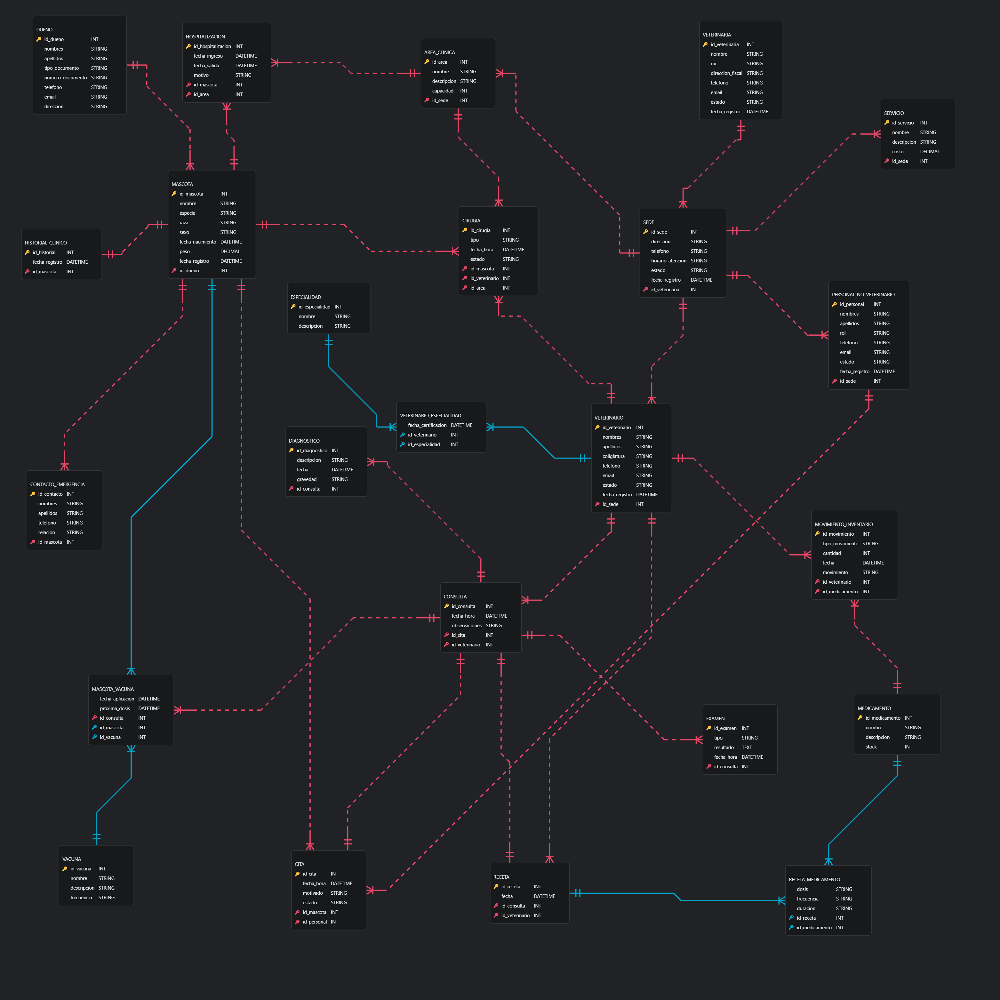

```sql
erDiagram
	MASCOTA {
		integer id_mascota PK
		string nombre
		string especie
		string raza
		string sexo
		date fecha_nacimiento
	}

	DUENO {
		integer id_dueno PK
		string nombres
		string apellidos
		string tipo_documento
		string numero_documento
		string telefono
		string email
		string direccion
	}

	CONTACTO_EMERGENCIA {
		integer id_contacto PK
		string nombres
		string apellidos
		string telefono
		string relacion
	}

	VETERINARIO {
		integer id_veterinario PK
		string nombres
		string apellidos
		string colegiatura
		string telefono
		string email
		string estado
		date fecha_registro
	}

	PERSONAL_NO_VETERINARIO {
		integer id_personal PK
		string nombres
		string apellidos
		string rol
		string telefono
		string email
		string estado
		date fecha_registro
	}

	VETERINARIA {
		integer id_veterinaria PK
		string nombre
		string ruc
		string direccion_fiscal
		string telefono
		string email
		string estado
		date fecha_registro
	}

	SEDE {
		integer id_sede PK
		string direccion
		string telefono
		string horario_atencion
		string estado
		date fecha_registro
	}

	AREA_CLINICA {
		integer id_area PK
		string nombre
		string descripcion
		integer capacidad
	}

	ESPECIALIDAD {
		integer id_especialidad PK
		string nombre
		string descripcion
	}

	VETERINARIO_ESPECIALIDAD {
		integer id_veterinario PK
		integer id_especialidad PK
		date fecha_certificacion
	}

	SERVICIO {
		integer id_servicio PK
		string nombre
		string descripcion
		decimal costo
	}

	CITA {
		integer id_cita PK
		date fecha_hora
		string motivo
		string estado
	}

	CONSULTA {
		integer id_consulta PK
		date fecha_hora
		string observaciones
	}

	DIAGNOSTICO {
		integer id_diagnostico PK
		string descripcion
		date fecha
		string gravedad
	}

	EXAMEN {
		integer id_examen PK
		string tipo
		text resultado
		date fecha_hora
	}

	VACUNA {
		integer id_vacuna PK
		string nombre
		string descripcion
		string frecuencia
	}

	MASCOTA_VACUNA {
		integer id_mascota PK
		integer id_vacuna PK
		date fecha_aplicacion
		date proxima_dosis
	}

	MEDICAMENTO {
		integer id_medicamento PK
		string nombre
		string descripcion
		integer stock
	}

	RECETA {
		integer id_receta PK
		date fecha
	}

	RECETA_MEDICAMENTO {
		integer id_receta PK
		integer id_medicamento PK
		string dosis
		string frecuencia
		string duracion
	}
	
	CIRUGIA {
		integer id_cirugia PK
		string tipo
		date fecha_hora
		string estado
	}

	HOSPITALIZACION {
		integer id_hospitalizacion PK
		date fecha_ingreso
		date fecha_salida
		string motivo
	}

	MOVIMIENTO_INVENTARIO {
		integer id_movimiento PK
		string tipo_movimiento
		integer cantidad
		date fecha
		string motivo
	}

	HISTORIAL_CLINICO {
		integer id_historial PK
		date fecha_registro
	}

	DUENO ||--o{ MASCOTA : es_dueno_de 
	MASCOTA }||--|| DUENO : pertenece_a
	MASCOTA ||--o{CONTACTO_EMERGENCIA : tiene
	CONTACTO_EMERGENCIA }||--|| MASCOTA : asociado_a
	MASCOTA ||--o{ CITA : programa
	CITA }||--|| MASCOTA : para
	MASCOTA ||--o{ CONSULTA : recibe
	CONSULTA }||--|| MASCOTA : de
	MASCOTA ||--|| HISTORIAL_CLINICO : posee
	HISTORIAL_CLINICO }||--|| MASCOTA : de
	MASCOTA ||--o{ CIRUGIA : se_somete_a
	CIRUGIA }||--|| MASCOTA : en
	MASCOTA ||--o{ HOSPITALIZACION : es_hospetalizada_en
	HOSPITALIZACION }||--|| MASCOTA : de
	MASCOTA }o--o{ VACUNA : recibe
	VETERINARIA ||--o{ SEDE : opera
	SEDE }||--|| VETERINARIA : pertenece_a
	SEDE ||--o{ AREA_CLINICA : contiene
	AREA_CLINICA }||--|| SEDE : en 
	SEDE ||--o{ SERVICIO : ofrece
	SERVICIO }||--|| SEDE : disponible_en
	SEDE ||--o{ VETERINARIO : emplea
	VETERINARIO }||--|| SEDE : trabaja_en
	SEDE ||--o{ PERSONAL_NO_VETERINARIO : contrata
	PERSONAL_NO_VETERINARIO }||--|| SEDE : empleado_en
	VETERINARIO }o--o{ ESPECIALIDAD : tiene
	ESPECIALIDAD }o--o{ VETERINARIO : de
	VETERINARIO ||--o{ CONSULTA : atiende
	CONSULTA }||--|| VETERINARIO : por
	VETERINARIO ||--o{ CIRUGIA : realiza
	CIRUGIA }||--|| VETERINARIO : operada_por
	VETERINARIO ||--o{ RECETA : prescribe
	RECETA }||--|| VETERINARIO : prescrita_por
	VETERINARIO ||--o{ MOVIMIENTO_INVENTARIO : autoriza
	MOVIMIENTO_INVENTARIO }||--|| VETERINARIO : autorizado_por
	PERSONAL_NO_VETERINARIO ||--o{ CITA : agenda
	CITA }||--|| PERSONAL_NO_VETERINARIO : registrada_por
	CITA ||--|| CONSULTA : deriva_en
	CONSULTA }||--|| CITA : proveniente_de
	CONSULTA ||--o{ DIAGNOSTICO : genera
	DIAGNOSTICO }||--|| CONSULTA : de
	CONSULTA ||--o{ EXAMEN : incluye
	EXAMEN }||--|| CONSULTA : solicitado_en
	CONSULTA ||--|| RECETA : produce
	RECETA }||--|| CONSULTA : generada_en
	CONSULTA ||--o{ MASCOTA_VACUNA : registra_vacuna_en
	MASCOTA_VACUNA }||--|| CONSULTA : aplicada_en
	AREA_CLINICA ||--o{ CIRUGIA : se_realiza_en
	CIRUGIA }||--|| AREA_CLINICA : en_area
	AREA_CLINICA ||--o{ HOSPITALIZACION : ocupa
	HOSPITALIZACION }||--|| AREA_CLINICA : en_area
	RECETA }o--o{ MEDICAMENTO : contiene
	MEDICAMENTO }o--o{ RECETA : en
	MEDICAMENTO ||--o{ MOVIMIENTO_INVENTARIO : tiene_movimiento_de
	MOVIMIENTO_INVENTARIO }||--|| MEDICAMENTO : de

```

### 3.3.2 Justificación del modelo entidad-relación lógico

El modelo entidad–relación lógico fue construido a partir del análisis del dominio de la veterinaria, identificando los objetos principales del sistema y las relaciones que existen entre ellos. Se seleccionaron como entidades independientes aquellas estructuras que poseen identidad propia y atributos que dependen funcionalmente de su clave primaria, asegurando la integridad y coherencia del modelo.

Por ejemplo, la entidad Mascota se identifica mediante id_mascota y posee atributos como nombre, especie, raza, sexo, fecha de nacimiento, peso y fecha de registro. Asimismo, cada mascota se vincula a un Dueño mediante la clave foránea id_dueno, reflejando la relación de uno a muchos (1:N) entre Dueño y Mascota: un dueño puede tener varias mascotas, pero cada mascota pertenece a un solo dueño. Esta decisión evita redundancia de información personal del dueño en cada registro de mascota y mantiene la integridad de los datos.

La entidad Consulta representa un evento clínico independiente y contiene las claves foráneas id_cita y id_veterinario. Esto permite relacionar cada consulta con la Cita correspondiente, y por extensión con la mascota, y con el veterinario que la atendió, estableciendo relaciones 1:N sin necesidad de entidades intermedias. De esta forma, una mascota puede tener múltiples consultas y un veterinario puede atender a muchas consultas, garantizando un registro detallado de los eventos clínicos.

Otras entidades como Diagnóstico, Examen, Receta y Cirugía se modelaron de forma independiente porque representan resultados o procedimientos derivados de una consulta. Cada una posee atributos propios y puede repetirse varias veces dentro del contexto de una misma consulta, evitando redundancia y permitiendo un seguimiento completo de la historia clínica.

En casos de relaciones muchos a muchos (N:M), como Mascota–Vacuna o Receta–Medicamento, se crearon entidades asociativas (Mascota_vacuna y Receta_medicamento) que contienen las claves foráneas de las entidades relacionadas. Esto permite almacenar atributos adicionales dependientes de la combinación de claves y transforma adecuadamente la relación N:M al modelo relacional.

La entidad Historial Clínico se definió como un agregado lógico de consultas, diagnósticos, exámenes, recetas, cirugías y hospitalizaciones asociados a una mascota. No se modeló como entidad autónoma con atributos propios, ya que su información puede derivarse mediante consultas al sistema, evitando duplicación de datos y simplificando el diseño.

El resto de entidades, como Veterinario, Personal_no_veterinario, Sede, Área_clínica, Servicio y Veterinaria, fueron modeladas con sus atributos y relaciones correspondientes para reflejar correctamente la estructura organizacional y operativa de la clínica, asegurando que cada evento, servicio o procedimiento quede correctamente registrado y vinculado a su contexto.

<div style="page-break-after: always"></div>

# CAPÍTULO IV: IMPLEMENTACIÓN DE LA BASE DE DATOS

## 4.1 Sistema de gestión de base de datos

### 4.1.1 Evaluación y elección del sistema de gestión de base de datos relacional

Para la selección del **Sistema de Gestión de Base de Datos (SGBD)** para **Pet Care**, se han evaluado las tres opciones más destacadas bajo los criterios de **compatibilidad**, **rendimiento** y **escalabilidad**.

| Criterio | MySQL | PostgreSQL | SQL Server |
|---|---|---|---|
| **Compatibilidad** | Alta con tecnologías web, pero con limitaciones en la integración con ecosistemas empresariales cerrados. | Excelente con sistemas Linux y herramientas de análisis de datos complejas. | Integración nativa con el ecosistema Microsoft (.NET). Ideal para reportes administrativos y gestión de Windows. |
| **Rendimiento** | Optimizado para operaciones de lectura de datos simples. Su rendimiento decae con exigencias complejas. | Alto rendimiento en procesos de escritura y lectura concurrentes de gran complejidad. | Gestiona eficientemente cargas de trabajo transaccionales pesadas y reportes en tiempo real. |
| **Escalabilidad** | Escalabilidad horizontal aceptable, pero compleja de gestionar en entornos de misión crítica. | Alta escalabilidad vertical y horizontal mediante particionamiento avanzado. | Permite un crecimiento fluido desde versiones Express, soportando terabytes de datos sin pérdida de eficiencia. |

Luego del análisis se determinó que **SQL Server** es la solución óptima para el proyecto por las siguientes razones:

En primer lugar, la **compatibilidad** es un factor crítico, ya que muchas herramientas administrativas y de oficina utilizadas por las pequeñas y medianas empresas se integran con SQL Server, lo que facilita la exportación y generación de informes de gestión.

En términos de **rendimiento**, SQL Server garantiza que las búsquedas y el procesamiento de facturas se realicen con una latencia mínima.

Finalmente, su **escalabilidad** asegura que a medida que Pet Care tenga nuevas oficinas, la base de datos podrá migrar a versiones más potentes o a la nube sin reescribir la estructura lógica, protegiendo la inversión en tecnología de la startup.


## 4.2 Diagrama de datos

### 4.2.1 Diagrama entidad–relación físico

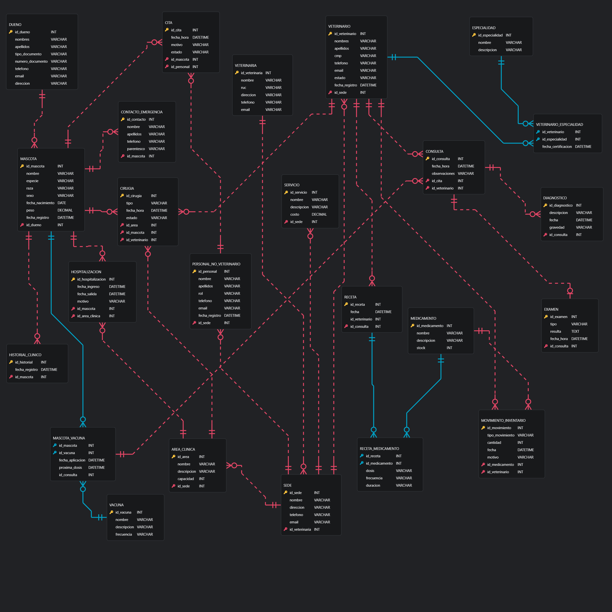

## 4.3 Scripts de la base de datos

### 4.3.1 Scripts de creación y carga de datos de la base de datos relacional

```sql
-- ============================================
-- Script de creación y carga de datos
-- Motor: SQL Server
-- ============================================

CREATE DATABASE PETCARE_DB;
GO

USE PETCARE_DB;
GO

CREATE TABLE VETERINARIA (
  id_veterinaria INT IDENTITY(1,1) PRIMARY KEY,
  nombre   VARCHAR(120) NOT NULL,
  ruc      VARCHAR(20)  NOT NULL UNIQUE,
  direccion VARCHAR(200) NULL,
  telefono  VARCHAR(20)  NULL,
  email     VARCHAR(120) NULL UNIQUE
);

CREATE TABLE SEDE (
  id_sede INT IDENTITY(1,1) PRIMARY KEY,
  nombre    VARCHAR(120) NOT NULL,
  direccion VARCHAR(200) NULL,
  telefono  VARCHAR(20)  NULL,
  email     VARCHAR(120) NULL,
  id_veterinaria INT NOT NULL,
  CONSTRAINT FK_SEDE_VETERINARIA
    FOREIGN KEY (id_veterinaria) REFERENCES VETERINARIA(id_veterinaria)
);

CREATE TABLE DUENO (
  id_dueno INT IDENTITY(1,1) PRIMARY KEY,
  nombres  VARCHAR(80)  NOT NULL,
  apellidos VARCHAR(80) NOT NULL,
  tipo_documento   VARCHAR(20) NULL,
  numero_documento VARCHAR(30) NULL UNIQUE,
  telefono VARCHAR(20) NULL,
  email    VARCHAR(120) NULL UNIQUE,
  direccion VARCHAR(200) NULL
);

CREATE TABLE MASCOTA (
  id_mascota INT IDENTITY(1,1) PRIMARY KEY,
  nombre  VARCHAR(60) NOT NULL,
  especie VARCHAR(30) NOT NULL,
  raza    VARCHAR(50) NULL,
  sexo    VARCHAR(10) NULL,
  fecha_nacimiento DATE NULL,
  peso DECIMAL(6,2) NULL,
  fecha_registro DATETIME NULL,
  id_dueno INT NOT NULL,
  CONSTRAINT FK_MASCOTA_DUENO
    FOREIGN KEY (id_dueno) REFERENCES DUENO(id_dueno)
);

CREATE TABLE CONTACTO_EMERGENCIA (
  id_contacto INT IDENTITY(1,1) PRIMARY KEY,
  nombre    VARCHAR(80) NOT NULL,
  apellidos VARCHAR(80) NULL,
  telefono  VARCHAR(20) NULL,
  relacion VARCHAR(40) NULL,
  id_mascota INT NOT NULL,
  CONSTRAINT FK_CONTACTO_MASCOTA
    FOREIGN KEY (id_mascota) REFERENCES MASCOTA(id_mascota)
);

CREATE TABLE AREA_CLINICA (
  id_area_clinica INT IDENTITY(1,1) PRIMARY KEY,
  nombre VARCHAR(120) NOT NULL,
  descripcion VARCHAR(200) NULL,
  capacidad INT NULL,
  id_sede INT NOT NULL,
  CONSTRAINT FK_AREA_SEDE
    FOREIGN KEY (id_sede) REFERENCES SEDE(id_sede)
);

CREATE TABLE SERVICIO (
  id_servicio INT IDENTITY(1,1) PRIMARY KEY,
  nombre VARCHAR(120) NOT NULL,
  descripcion VARCHAR(200) NULL,
  costo DECIMAL(10,2) NOT NULL,
  id_sede INT NOT NULL,
  CONSTRAINT FK_SERVICIO_SEDE
    FOREIGN KEY (id_sede) REFERENCES SEDE(id_sede)
);

CREATE TABLE PERSONAL_NO_VETERINARIO (
  id_personal INT IDENTITY(1,1) PRIMARY KEY,
  nombre VARCHAR(80) NOT NULL,
  apellidos VARCHAR(80) NOT NULL,
  rol VARCHAR(50) NOT NULL,
  telefono VARCHAR(20) NULL,
  email VARCHAR(120) NULL UNIQUE,
  fecha_registro DATETIME NULL,
  id_sede INT NOT NULL,
  CONSTRAINT FK_PERSONAL_SEDE
    FOREIGN KEY (id_sede) REFERENCES SEDE(id_sede)
);

CREATE TABLE VETERINARIO (
  id_veterinario INT IDENTITY(1,1) PRIMARY KEY,
  nombres  VARCHAR(80) NOT NULL,
  apellidos VARCHAR(80) NOT NULL,
  colegiatura VARCHAR(20) NULL UNIQUE,
  telefono VARCHAR(20) NULL,
  email VARCHAR(120) NULL UNIQUE,
  estado VARCHAR(20) NULL,
  fecha_registro DATETIME NULL,
  id_sede INT NOT NULL,
  CONSTRAINT FK_VETERINARIO_SEDE
    FOREIGN KEY (id_sede) REFERENCES SEDE(id_sede)
);

CREATE TABLE ESPECIALIDAD (
  id_especialidad INT IDENTITY(1,1) PRIMARY KEY,
  nombre VARCHAR(120) NOT NULL UNIQUE,
  descripcion VARCHAR(200) NULL
);

CREATE TABLE VETERINARIO_ESPECIALIDAD (
  id_veterinario INT NOT NULL,
  id_especialidad INT NOT NULL,
  fecha_certificacion DATETIME NULL,
  CONSTRAINT PK_VET_ESPEC PRIMARY KEY (id_veterinario, id_especialidad),
  CONSTRAINT FK_VE_VETERINARIO
    FOREIGN KEY (id_veterinario) REFERENCES VETERINARIO(id_veterinario),
  CONSTRAINT FK_VE_ESPECIALIDAD
    FOREIGN KEY (id_especialidad) REFERENCES ESPECIALIDAD(id_especialidad)
);

CREATE TABLE CITA (
  id_cita INT IDENTITY(1,1) PRIMARY KEY,
  fecha_hora DATETIME NOT NULL,
  motivo VARCHAR(200) NULL,
  estado VARCHAR(30) NULL,
  id_mascota INT NOT NULL,
  id_personal INT NULL,
  CONSTRAINT FK_CITA_MASCOTA
    FOREIGN KEY (id_mascota) REFERENCES MASCOTA(id_mascota),
  CONSTRAINT FK_CITA_PERSONAL
    FOREIGN KEY (id_personal) REFERENCES PERSONAL_NO_VETERINARIO(id_personal)
);

CREATE TABLE CONSULTA (
  id_consulta INT IDENTITY(1,1) PRIMARY KEY,
  fecha_hora DATETIME NOT NULL,
  observaciones VARCHAR(500) NULL,
  id_veterinario INT NOT NULL,
  id_mascota INT NOT NULL,
  CONSTRAINT FK_CONSULTA_VETERINARIO
    FOREIGN KEY (id_veterinario) REFERENCES VETERINARIO(id_veterinario),
  CONSTRAINT FK_CONSULTA_MASCOTA
    FOREIGN KEY (id_mascota) REFERENCES MASCOTA(id_mascota)
);

CREATE TABLE DIAGNOSTICO (
  id_diagnostico INT IDENTITY(1,1) PRIMARY KEY,
  descripcion VARCHAR(500) NOT NULL,
  fecha DATETIME NULL,
  gravedad VARCHAR(30) NULL,
  id_consulta INT NOT NULL,
  CONSTRAINT FK_DIAG_CONSULTA
    FOREIGN KEY (id_consulta) REFERENCES CONSULTA(id_consulta)
);

CREATE TABLE EXAMEN (
  id_examen INT IDENTITY(1,1) PRIMARY KEY,
  tipo VARCHAR(80) NOT NULL,
  resultado VARCHAR(200) NULL,
  fecha_hora DATETIME NULL,
  id_consulta INT NOT NULL,
  CONSTRAINT FK_EXAMEN_CONSULTA
    FOREIGN KEY (id_consulta) REFERENCES CONSULTA(id_consulta)
);

CREATE TABLE VACUNA (
  id_vacuna INT IDENTITY(1,1) PRIMARY KEY,
  nombre VARCHAR(120) NOT NULL UNIQUE,
  descripcion VARCHAR(200) NULL,
  frecuencia VARCHAR(60) NULL
);

CREATE TABLE MASCOTA_VACUNA (
  id_mascota INT NOT NULL,
  id_vacuna INT NOT NULL,
  fecha_aplicacion DATETIME NULL,
  proxima_dosis DATETIME NULL,
  id_consulta INT NOT NULL,
  CONSTRAINT PK_MASCOTA_VACUNA PRIMARY KEY (id_mascota, id_vacuna),
  CONSTRAINT FK_MV_MASCOTA
    FOREIGN KEY (id_mascota) REFERENCES MASCOTA(id_mascota),
  CONSTRAINT FK_MV_VACUNA
    FOREIGN KEY (id_vacuna) REFERENCES VACUNA(id_vacuna),
  CONSTRAINT FK_MV_CONSULTA
    FOREIGN KEY (id_consulta) REFERENCES CONSULTA(id_consulta)
);

CREATE TABLE HISTORIAL_CLINICO (
  id_historial INT IDENTITY(1,1) PRIMARY KEY,
  fecha_registro DATETIME NOT NULL,
  id_mascota INT NOT NULL,
  CONSTRAINT FK_HC_MASCOTA
    FOREIGN KEY (id_mascota) REFERENCES MASCOTA(id_mascota)
);

CREATE TABLE HOSPITALIZACION (
  id_hospitalizacion INT IDENTITY(1,1) PRIMARY KEY,
  fecha_ingreso DATETIME NOT NULL,
  fecha_salida DATETIME NULL,
  motivo VARCHAR(200) NULL,
  id_mascota INT NOT NULL,
  id_area_clinica INT NOT NULL,
  CONSTRAINT FK_HOSP_MASCOTA
    FOREIGN KEY (id_mascota) REFERENCES MASCOTA(id_mascota),
  CONSTRAINT FK_HOSP_AREA
    FOREIGN KEY (id_area_clinica) REFERENCES AREA_CLINICA(id_area_clinica)
);

CREATE TABLE CIRUGIA (
  id_cirugia INT IDENTITY(1,1) PRIMARY KEY,
  tipo VARCHAR(80) NOT NULL,
  fecha_hora DATETIME NOT NULL,
  estado VARCHAR(30) NULL,
  id_area_clinica INT NOT NULL,
  id_mascota INT NOT NULL,
  id_veterinario INT NOT NULL,
  CONSTRAINT FK_CIR_AREA
    FOREIGN KEY (id_area_clinica) REFERENCES AREA_CLINICA(id_area_clinica),
  CONSTRAINT FK_CIR_MASCOTA
    FOREIGN KEY (id_mascota) REFERENCES MASCOTA(id_mascota),
  CONSTRAINT FK_CIR_VETERINARIO
    FOREIGN KEY (id_veterinario) REFERENCES VETERINARIO(id_veterinario)
);

CREATE TABLE MEDICAMENTO (
  id_medicamento INT IDENTITY(1,1) PRIMARY KEY,
  nombre VARCHAR(120) NOT NULL UNIQUE,
  descripcion VARCHAR(200) NULL,
  stock INT NOT NULL
);

CREATE TABLE MOVIMIENTO_INVENTARIO (
  id_movimiento INT IDENTITY(1,1) PRIMARY KEY,
  tipo_movimiento VARCHAR(30) NOT NULL,
  cantidad INT NOT NULL,
  fecha DATETIME NOT NULL,
  motivo VARCHAR(200) NULL,
  id_veterinario INT NOT NULL,
  id_medicamento INT NOT NULL,
  CONSTRAINT FK_MI_VETERINARIO
    FOREIGN KEY (id_veterinario) REFERENCES VETERINARIO(id_veterinario),
  CONSTRAINT FK_MI_MEDICAMENTO
    FOREIGN KEY (id_medicamento) REFERENCES MEDICAMENTO(id_medicamento)
);

CREATE TABLE RECETA (
  id_receta INT IDENTITY(1,1) PRIMARY KEY,
  fecha DATETIME NOT NULL,
  id_veterinario INT NOT NULL,
  CONSTRAINT FK_RECETA_VETERINARIO
    FOREIGN KEY (id_veterinario) REFERENCES VETERINARIO(id_veterinario)
);

CREATE TABLE RECETA_MEDICAMENTO (
  id_receta INT NOT NULL,
  id_medicamento INT NOT NULL,
  dosis VARCHAR(60) NULL,
  frecuencia VARCHAR(60) NULL,
  duracion VARCHAR(60) NULL,
  CONSTRAINT PK_RECETA_MED PRIMARY KEY (id_receta, id_medicamento),
  CONSTRAINT FK_RM_RECETA
    FOREIGN KEY (id_receta) REFERENCES RECETA(id_receta),
  CONSTRAINT FK_RM_MEDICAMENTO
    FOREIGN KEY (id_medicamento) REFERENCES MEDICAMENTO(id_medicamento)
);

-- =========================
-- DATOS DE PRUEBA
-- =========================

-- 1. VETERINARIA (Matriz)
INSERT INTO VETERINARIA (nombre, ruc, direccion, telefono, email) VALUES 
('PetCare Corporación S.A.C', '20601234567', 'Av. Javier Prado 1500, San Isidro', '014223344', 'corporativo@petcare.com');

-- 2. SEDE 
INSERT INTO SEDE (nombre, direccion, telefono, email, id_veterinaria) VALUES 
('PetCare Jesús María', 'Av. Salaverry 1400', '955111010', 'jesusmaria@petcare.com', 1),
('PetCare Rimac', 'Jr. Los Molinos 897', '955111002', 'rimac@petcare.com', 1),
('PetCare La Molina', 'Av. Raul Ferrero 1205', '955111005', 'lamolina@petcare.com', 1),
('PetCare Miraflores', 'Calle Schell 320', '955111008', 'miraflores@petcare.com', 1),
('PetCare Surco', 'Av. Caminos del Inca 450', '955111003', 'surco@petcare.com', 1),
('PetCare San Borja', 'Av. San Borja Sur 700', '955111011', 'sanborja@petcare.com', 1),
('PetCare Barranco', 'Av. San Martin 400', '955111020', 'barranco@petcare.com', 1),
('PetCare Los Olivos', 'Av. Carlos Izaguirre 150', '955111021', 'losolivos@petcare.com', 1),
('PetCare San Isidro', 'Av. Dos de Mayo 800', '955111022', 'sanisidro@petcare.com', 1),
('PetCare Ate', 'Av. Metropolitana 250', '955111023', 'ate@petcare.com', 1),
('PetCare Chorrillos', 'Av. Defensores del Morro 500', '955111024', 'chorrillos@petcare.com', 1);

-- 3. DUENO 
INSERT INTO DUENO (nombres, apellidos, tipo_documento, numero_documento, telefono, email, direccion) VALUES 
('Olenka', 'Espinoza Gomez', 'DNI', '75781234', '988100201', 'olenk@gmail.com', 'Av. Brasil 1971, Jesús María'),
('Luis', 'Calderon Ramírez', 'DNI', '10457896', '988100202', 'lcald@hotmail.com', 'Av. Guardia Republicana 984, Rimac'),
('Ricardo', 'Salas Torres', 'DNI', '42568912', '988100203', 'rsalas@gmail.com', 'Calle Los Jazmines 220, La Molina'),
('Andrea', 'Paredes Lozano', 'DNI', '51236789', '988100204', 'aparedes@yahoo.com', 'Calle Porta 180, Miraflores'),
('Fernando', 'Castro Rojas', 'DNI', '87654321', '988100205', 'ferojas@hotmail.com', 'Av. Primavera 1225, Surco'),
('Maria', 'Mendoza Flores', 'DNI', '99874561', '988100206', 'maflores@gmail.com', 'Jr. Fray Luis de Leon 476, San Borja'),
('Carlos', 'Mendoza Prado', 'DNI', '12345678', '988100207', 'cmendoza@gmail.com', 'Av. Las Palmeras 123, Villa El Salvador'),
('Lucia', 'Fernandez Rio', 'DNI', '23456789', '988100208', 'lfernandez@gmail.com', 'Jr. Ucayali 456, Lima'),
('Roberto', 'Gomez Siccha', 'DNI', '34567890', '988100209', 'rgomez@gmail.com', 'Calle Los Pinos 789, San Isidro'),
('Paola', 'Rios Medina', 'DNI', '45612378', '988100210', 'prios@gmail.com', 'Av. Angamos 450, Surquillo'),
('Jorge', 'Quispe Ramos', 'DNI', '56781234', '988100211', 'jquispe@gmail.com', 'Av. Canada 1000, La Victoria'),
('Diana', 'Salazar Cruz', 'DNI', '67891234', '988100212', 'dsalazar@gmail.com', 'Av. Brasil 900, Magdalena');

-- 4. MASCOTA 
INSERT INTO MASCOTA (nombre, especie, raza, sexo, fecha_nacimiento, peso, fecha_registro, id_dueno) VALUES 
('Michi', 'Gato', 'Persa', 'F', '2024-05-20', 4.2, '2025-07-13', 1),
('Fortin', 'Perro', 'Pastor Aleman', 'M', '2023-06-15', 25.5, '2025-02-10', 2),
('Toby', 'Perro', 'Poodle', 'M', '2022-08-05', 6.5, '2025-04-10', 2),
('Simba', 'Gato', 'Siames', 'M', '2024-08-05', 3.8, '2025-03-20', 4),
('Rocky', 'Perro', 'Bulldog Frances', 'M', '2023-09-12', 12.5, '2025-11-10', 5),
('Nala', 'Perro', 'Golden Retriever', 'F', '2022-03-18', 30.2, '2024-05-20', 6),
('Rex', 'Perro', 'Pastor Aleman', 'M', '2021-05-10', 28.0, '2025-01-15', 7),
('Luna', 'Gato', 'Angora', 'F', '2022-11-20', 3.5, '2025-01-20', 1),
('Coco', 'Perro', 'Beagle', 'M', '2023-03-12', 15.2, '2025-02-01', 9),
('Max', 'Perro', 'Labrador', 'M', '2021-07-01', 27.0, '2025-03-01', 10),
('Kiara', 'Gato', 'Maine Coon', 'F', '2023-01-10', 5.1, '2025-04-01', 11),
('Bruno', 'Perro', 'Boxer', 'M', '2020-09-09', 29.0, '2025-05-01', 12),
('Loki','Perro','Husky','M','2022-02-02',22.4,'2025-06-01',1),
('Mila','Gato','Siames','F','2023-03-03',3.9,'2025-06-02',1),
('Thor','Perro','Doberman','M','2021-01-15',32.0,'2025-06-03',3),
('Kira','Perro','Husky','F','2022-05-10',18.5,'2025-06-04',6),
('Zeus','Perro','Rottweiler','M','2020-09-09',40.0,'2025-06-05',4),
('Cleo','Gato','Bengala','F','2023-04-18',4.5,'2025-06-06',5),
('Bobby','Perro','Cocker','M','2022-12-12',14.0,'2025-06-07',6),
('Mora','Gato','Criollo','F','2024-01-01',3.2,'2025-06-08',7),
('Kori','Perro','Jack Russell','M','2022-10-06',9.5,'2025-06-09',8),
('Nina','Perro','Shih Tzu','F','2023-07-07',7.2,'2025-06-10',9),
('Rocco','Perro','Boxer','M','2022-10-10',26.0,'2025-06-11',10),
('Luna II','Gato','Angora','F','2023-08-08',3.7,'2025-06-12',11);

-- 5. CONTACTO_EMERGENCIA
INSERT INTO CONTACTO_EMERGENCIA (nombre, apellidos, telefono, relacion, id_mascota) VALUES 
('Nataly', 'Aguilar Gomez', '911222331', 'Prima', 1),
('Diana', 'Calderon Quispe', '911222332', 'Hija', 2),
('Felipe', 'Salas Mendoza', '911222333', 'Hermano', 3),
('Rosa', 'Paredes Linares', '911222334', 'Madre', 4),
('Carlos', 'Castro Vega', '911222335', 'Padre', 5),
('Luciana', 'Gutierrez Flores', '911222336', 'Hermana', 6),
('Alberto', 'Mendoza Garcia', '999888777', 'Padre', 7),
('Elena', 'Rio Martinez', '999888778', 'Madre', 8),
('Pedro', 'Gomez Peralta', '999888779', 'Hermano', 9),
('Andrea', 'Rios Torres', '911333440', 'Tía', 10),
('Luis', 'Quispe Salas', '911333441', 'Primo', 11),
('Marcos', 'Salazar Diaz', '911333442', 'Padre', 12);

-- 6. AREA_CLINICA
INSERT INTO AREA_CLINICA (nombre, descripcion, capacidad, id_sede) VALUES 
('Rayos X', 'Sala de diagnóstico por imágenes', 1, 1),
('Laboratorio', 'Análisis de sangre y muestras', 3, 1),
('Consultorio 1', 'Atención general', 2, 3),
('Quirófano', 'Cirugías menores y mayores', 1, 4),
('Hospitalización', 'Internamiento de mascotas', 6, 5),
('Ecografía', 'Diagnóstico por ultrasonido', 1, 6),
('UCI', 'Unidad de cuidados intensivos', 2, 7),
('Rehabilitacion', 'Area de terapias fisicas', 4, 8),
('Triaje', 'Evaluacion rapida inicial', 3, 9),
('Consultorio 2', 'Atención general avanzada', 2, 10),
('Sala Postoperatoria', 'Recuperación post cirugía', 4, 11);

-- 7. SERVICIO 
INSERT INTO SERVICIO (nombre, descripcion, costo, id_sede) VALUES 
('Consulta General', 'Revisión básica', 30.00, 2),
('Vacunación', 'Aplicación de vacunas anuales', 80.00, 1),
('Perfil Bioquímico', 'Análisis de sangre completo', 120.00, 3),
('Ecografía', 'Diagnóstico por ultrasonido', 150.00, 6),
('Cirugía', 'Procedimientos quirúrgicos', 400.00, 4),
('Hospitalización', 'Internamiento diario', 180.00, 5),
('Limpieza Ocular', 'Lavado especializado de ojos', 45.00, 7),
('Corte de uñas', 'Servicio estetico basico', 20.00, 8),
('Consulta Especialista', 'Atencion por cardiologo/oncologo', 120.00, 9),
('Desparasitación', 'Control antiparasitario', 50.00, 10),
('Control Nutricional', 'Plan alimenticio personalizado', 90.00, 11);

-- 8. PERSONAL_NO_VETERINARIO
INSERT INTO PERSONAL_NO_VETERINARIO (nombre, apellidos, rol, telefono, email, fecha_registro, id_sede) VALUES 
('María', 'García Pérez', 'Recepcionista', '922000101', 'mgarcia@petcare.com', '2025-01-28', 1),
('Pedro', 'Ramírez López', 'Administrador', '922000102', 'pramirez@petcare.com', '2025-01-17', 2),
('César', 'Ramos Acosta', 'Recepcionista', '922000103', 'rgil@petcare.com', '2025-03-01', 3),
('Jorge', 'Mendoza Ríos', 'Cajero', '922000105', 'jmrios@petcare.com', '2025-03-15', 4),
('Carmen', 'Vega Castillo', 'Esteticista', '922000106', 'ccvega@petcare.com', '2025-01-05', 5),
('Diego', 'Salas Paredes', 'Recepcionista', '922000107', 'dsalas@petcare.com', '2025-10-20', 6),
('Raul', 'Zevallos Arbeloa', 'Seguridad', '922000108', 'rzevallos@petcare.com', '2025-02-01', 7),
('Marta', 'Soto Diaz', 'Limpieza', '922000109', 'msoto@petcare.com', '2025-02-05', 8),
('Sofia', 'Vaca Perez', 'Contadora', '922000110', 'svaca@petcare.com', '2025-02-10', 9),
('Luis', 'Torres Vega', 'Recepcionista', '922000111', 'ltorres@petcare.com', '2025-03-10', 10),
('Ana', 'Flores Ruiz', 'Cajera', '922000112', 'aflores@petcare.com', '2025-03-12', 11),
('Ana', 'Lopez Diaz', 'Esteticista', '922000120', 'alopez@petcare.com', '2026-02-10', 1),
('Luis', 'Torres Salazar', 'Esteticista', '922000121', 'ltorres2@petcare.com', '2026-02-10', 2),
('Sofia', 'Morales Vega', 'Esteticista', '922000122', 'smorales@petcare.com', '2026-02-10', 3),
('Diego', 'Sanchez Rojas', 'Esteticista', '922000123', 'dsanchez@petcare.com', '2026-02-10', 4),
('Patricia', 'Lozano Ruiz', 'Esteticista', '922000124', 'plozano2@petcare.com', '2026-02-10', 6),
('Brenda', 'Ponce Ramos', 'Esteticista', '922000125', 'bponce2@petcare.com', '2026-02-10', 7),
('Camila', 'Suarez Diaz', 'Esteticista', '922000126', 'csuarez2@petcare.com', '2026-02-10', 8),
('Oscar', 'Flores Vega', 'Esteticista', '922000127', 'oflores2@petcare.com', '2026-02-10', 9),
('Ivan', 'Gutierrez Silva', 'Esteticista', '922000128', 'igutierrez2@petcare.com', '2026-02-10', 10),
('Natalia', 'Vega Torres', 'Esteticista', '922000129', 'nvega2@petcare.com', '2026-02-10', 11);

-- 9. VETERINARIO
INSERT INTO VETERINARIO (nombres, apellidos, colegiatura, telefono, email, estado, fecha_registro, id_sede) VALUES 
('Rosa', 'Mendoza Castillo', 'CMVP1001', '933000201', 'rmendoza@petcare.com', 'Activo', '2025-01-27', 1),
('Silvia', 'Vargas Díaz', 'CMVP1002', '933000202', 'svargas@petcare.com', 'Activo', '2025-01-16', 2),
('Daniel', 'Sánchez Castro', 'CMVP1003', '933000203', 'dsosa@petcare.com', 'Activo', '2025-03-05', 3),
('Fernanda', 'Lopez Morales', 'CMVP1004', '933000204', 'flopez@petcare.com', 'Activo', '2025-01-20', 4),
('Javier', 'Torres Pineda', 'CMVP1005', '933000205', 'jtorres@petcare.com', 'Activo', '2025-03-12', 5),
('Karla', 'Rojas Sánchez', 'CMVP1006', '933000206', 'krojas@petcare.com', 'Activo', '2025-02-25', 6),
('Alberto', 'Ruiz Huaman', 'CMVP2001', '933000207', 'aruiz@petcare.com', 'Activo', '2025-02-01', 7),
('Elena', 'Sanz Lopez', 'CMVP2002', '933000208', 'esanz@petcare.com', 'Activo', '2025-02-05', 8),
('Pedro', 'Vaca Vazquez', 'CMVP2003', '933000209', 'pvaca@petcare.com', 'Activo', '2025-02-10', 9),
('Andrea', 'Salazar Ruiz', 'CMVP2004', '933000210', 'asalazar@petcare.com', 'Activo', '2025-03-01', 10),
('Luis', 'Quispe Romero', 'CMVP2005', '933000211', 'lquispe@petcare.com', 'Activo', '2025-03-02', 11),
('Marcos','Diaz Lopez','CMVP3001','933000212','mdiaz@petcare.com','Activo','2025-03-10',1),
('Claudia','Ramos Perez','CMVP3002','933000213','cramos@petcare.com','Activo','2025-03-11',2),
('Ivan','Gutierrez Silva','CMVP3003','933000214','igutierrez@petcare.com','Activo','2025-03-12',3),
('Natalia','Vega Torres','CMVP3004','933000215','nvega@petcare.com','Activo','2025-03-13',4),
('Raul','Morales Castro','CMVP3005','933000216','rmorales@petcare.com','Activo','2025-03-14',5),
('Patricia','Lozano Ruiz','CMVP3006','933000217','plozano@petcare.com','Activo','2025-03-15',6),
('Diego','Herrera Soto','CMVP3007','933000218','dherrera@petcare.com','Activo','2025-03-16',7),
('Camila','Suarez Diaz','CMVP3008','933000219','csuarez@petcare.com','Activo','2025-03-17',8),
('Brenda','Ponce Ramos','CMVP3009','933000220','bponce@petcare.com','Activo','2025-03-18',9),
('Oscar','Flores Vega','CMVP3010','933000221','oflores@petcare.com','Activo','2025-03-19',10),
('Luciano','Mendoza Gil','CMVP3011','933000222','lmendoza@petcare.com','Activo','2025-03-20',11);

-- 10. ESPECIALIDAD
INSERT INTO ESPECIALIDAD (nombre, descripcion) VALUES 
('Cardiología', 'Enfermedades del corazón'),
('Dermatología', 'Problemas de piel y alergias'),
('Fisiatría', 'Rehabilitación física y terapias de movilidad'),
('Oftalmología', 'Afecciones oculares y cirugía de ojos'),
('Odontología', 'Salud dental y limpiezas especializadas'),
('Neurología', 'Trastornos del sistema nervioso'),
('Oncología', 'Tratamiento de tumores'),
('Nutrición', 'Dietas especializadas'),
('Etologia', 'Comportamiento animal'),
('Cirugía General', 'Procedimientos quirúrgicos básicos y avanzados');

-- 11. VETERINARIO_ESPECIALIDAD
INSERT INTO VETERINARIO_ESPECIALIDAD (id_veterinario, id_especialidad, fecha_certificacion) VALUES 
(1,2,'2021-06-01'),
(2,1,'2022-08-15'),
(3,3,'2023-11-20'),
(4,4,'2020-09-10'),
(5,6,'2022-12-05'),
(6,5,'2021-04-22'),
(7,7,'2020-05-15'),
(8,8,'2021-11-20'),
(9,9,'2022-01-10'),
(10,10,'2021-03-12'),
(11,10,'2022-07-18'),
(12,3,'2020-05-09'),
(13,1,'2021-04-10'),
(14,2,'2022-02-14'),
(15,3,'2023-01-25'),
(16,4,'2020-11-11'),
(17,5,'2021-09-09'),
(18,6,'2022-10-10'),
(19,7,'2021-08-08'),
(20,8,'2023-03-03'),
(21,9,'2022-12-12'),
(22,10,'2021-05-05');

-- 12. CITA
INSERT INTO CITA (fecha_hora, motivo, estado, id_mascota, id_personal) VALUES 
('2025-08-15 09:00', 'Control de alergia', 'Completada', 1, 1),
('2025-03-10 10:30', 'Chequeo cardiaco', 'Pendiente', 2, 2),
('2025-05-12 11:00', 'Terapia de rehabilitación', 'Completada', 3, 3),
('2025-09-05 08:30', 'Vacunación anual', 'Programada', 4, 4),
('2025-04-18 12:15', 'Limpieza dental', 'Completada', 5, 5),
('2025-06-22 15:45', 'Cirugía rodilla', 'Programada', 6, 6),
('2025-11-01 09:00', 'Evaluacion oncologica', 'Programada', 7, 7), ('2025-11-02 10:00', 'Cambio de dieta', 'Programada', 8, 8), 
('2025-11-03 11:00', 'Agresividad', 'Programada', 9, 9),
('2025-11-05 09:00', 'Control general','Programada',10,1),
('2025-11-06 10:00', 'Vacunación','Programada',11,2),
('2025-11-07 11:00', 'Desparasitación','Programada',12,3),
('2025-11-08 12:00', 'Chequeo nutricional','Pendiente',1,4),
('2025-11-09 13:00', 'Revisión dental','Pendiente',2,5),
('2025-11-10 14:00', 'Evaluación neurologica','Programada',3,6);

-- 13. CONSULTA
INSERT INTO CONSULTA (fecha_hora, observaciones, id_veterinario, id_mascota) VALUES 
('2025-08-15 09:15', 'Presenta prurito en orejas', 1, 1),
('2025-03-10 10:45', 'Ritmo cardiaco estable', 2, 2),
('2025-05-12 11:30', 'Muestra debilidad en tren posterior', 3, 3),
('2025-09-05 08:50', 'Próxima dosis en 2026.', 4,4),
('2025-04-18 12:30', 'Se detecta sarro moderado.', 5, 5),
('2025-06-22 16:00', 'Evaluación prequirúrgica completa.', 6, 6),
('2025-11-01 09:15', 'Masa palpable en abdomen', 7, 7), 
('2025-11-02 10:15', 'Sobrepeso evidente', 8, 8), 
('2025-11-03 11:15', 'Muestra ansiedad por separacion', 9, 9),
('2025-11-05 09:30', 'Control sin novedades',12,10),
('2025-11-06 10:30', 'Vacuna aplicada correctamente',13,11),
('2025-11-07 11:30', 'Desparasitación completada',14,12),
('2025-11-08 12:30', 'Ligero sobrepeso',15,13),
('2025-11-09 13:30', 'Sarro leve',16,14),
('2025-11-10 14:30', 'Convulsión aislada',17,15),
('2025-03-01 09:20','Vacuna aplicada sin reacción',10,10),
('2025-04-01 10:20','Vacuna aplicada correctamente',11,11),
('2025-05-01 11:20','Paciente estable',12,12),
('2025-06-01 09:50','Refuerzo aplicado',13,13),
('2025-06-02 10:50','Sin reacciones adversas',14,14),
('2025-06-03 11:50','Vacuna aplicada correctamente',15,15),
('2025-06-04 12:20','Paciente en buen estado',16,16),
('2025-06-05 09:20','Vacuna aplicada',17,17),
('2025-06-06 10:20','Refuerzo felino correcto',18,18),
('2025-06-07 11:20','Sin hallazgos',19,19),
('2025-06-08 12:20','Vacuna aplicada correctamente',20,20),
('2025-06-09 13:20','Sin reacción',21,21),
('2025-06-10 14:20','Vacuna aplicada correctamente',22,22),
('2025-06-11 09:20','Refuerzo aplicado',1,23),
('2025-06-12 10:20','Vacuna aplicada correctamente',2,24),
('2025-07-01 09:20','Sobrepeso leve',3,10),
('2025-07-05 10:20','Dermatitis leve en abdomen',4,14),
('2025-07-10 11:20','Sarro moderado',5,18),
('2025-07-15 12:20','Soplo leve detectado',6,21);

-- 14. DIAGNOSTICO
INSERT INTO DIAGNOSTICO (descripcion, fecha, gravedad, id_consulta) VALUES 
('Dermatitis alérgica', '2025-08-15', 'Baja', 1),
('Sano con observación', '2025-03-10', 'Baja', 2),
('Displasia de cadera leve', '2025-05-12', 'Media', 3),
('Saludable, sin novedades', '2025-09-05', 'Baja', 4),
('Sarro dental moderado', '2025-04-18', 'Baja', 5),
('Rotura de ligamento cruzado', '2025-06-22', 'Alta', 6),
('Posible lipoma', '2025-11-01', 'Media', 7), 
('Obesidad grado I', '2025-11-02', 'Baja', 8), 
('Trastorno de ansiedad', '2025-11-03', 'Baja', 9),
('Paciente sano','2025-03-01','Baja',16),
('Paciente sano','2025-04-01','Baja',17),
('Sin hallazgos','2025-05-01','Baja',18),
('Vacunación preventiva','2025-06-01','Baja',19),
('Paciente sano','2025-06-02','Baja',20),
('Paciente sano','2025-06-03','Baja',21),
('Sin novedades','2025-06-04','Baja',22),
('Paciente sano','2025-06-05','Baja',23),
('Paciente sano','2025-06-06','Baja',24),
('Paciente sano','2025-06-07','Baja',25),
('Paciente sano','2025-06-08','Baja',26),
('Paciente sano','2025-06-09','Baja',27),
('Paciente sano','2025-06-10','Baja',28),
('Vacunación preventiva','2025-06-11','Baja',29),
('Paciente sano','2025-06-12','Baja',30),
('Sobrepeso leve','2025-07-01','Media',31),
('Dermatitis leve','2025-07-05','Baja',32),
('Sarro dental','2025-07-10','Media',33),
('Soplo cardiaco leve','2025-07-15','Media',34);

-- 15. EXAMEN
INSERT INTO EXAMEN (tipo, resultado, fecha_hora, id_consulta) VALUES 
('Raspado cutáneo', 'Negativo a ácaros', '2025-08-15 10:00', 1),
('Ecografía cardiaca', 'Sin anomalías', '2025-03-10 11:30', 2),
('Evaluación Postural', 'Dificultad al levantarse', '2025-05-12 12:00', 3),
('Hemograma completo', 'Valores dentro de rangos normales', '2025-09-05 09:30', 4),
('Radiografía dental', 'Sarro moderado en molares', '2025-04-18 13:00', 5),
('Radiografía de rodilla', 'Rotura de ligamento cruzado confirmada', '2025-06-22 16:30', 6),
('Biopsia', 'Pendiente', '2025-11-01 12:00', 7),
('Panel Tiroideo', 'Normal', '2025-11-02 13:00', 8),
('Test de comportamiento', 'Ansiedad confirmada', '2025-11-03 14:00', 9),
('Perfil lipidico', 'Colesterol levemente elevado', '2025-07-01 09:40', 31),
('Electrocardiograma', 'Soplo leve confirmado', '2025-07-15 12:40', 34);

-- 16. VACUNA
INSERT INTO VACUNA (nombre, descripcion, frecuencia) VALUES 
('Triple Felina', 'Rinotraqueítis, Calicivirus', 'Anual'),
('Antirrábica', 'Prevención de rabia', 'Anual'),
('KC', 'Tos de las perreras', 'Semestral'),
('Quíntuple Canina', 'Moquillo, Hepatitis, Parvovirus, Parainfluenza y Leptospira', 'Anual'),
('Giardia', 'Prevención de Giardiasis', 'Semestral'),
('Leucemia Felina', 'Refuerzo FeLV', 'Anual'), 
('Distemper', 'Prevencion Moquillo', 'Anual'), 
('Bordetella', 'Tos de las perreras', 'Semestral'),
('Parvovirus', 'Prevención Parvovirosis', 'Anual'),
('Influenza Canina', 'Prevención Influenza', 'Anual'),
('Calicivirus Felino', 'Refuerzo respiratorio', 'Anual'),
('Leptospira', 'Prevención Leptospirosis', 'Semestral'),
('Panleucopenia', 'Prevención viral felina', 'Anual');

-- 17. MASCOTA_VACUNA
INSERT INTO MASCOTA_VACUNA (id_mascota, id_vacuna, fecha_aplicacion, proxima_dosis, id_consulta) VALUES 
(1, 1, '2025-08-15', '2026-08-15', 1),
(2, 2, '2025-03-10', '2026-03-10', 2),
(3, 3, '2025-05-12', '2025-11-12', 3),
(4, 4, '2025-09-05', '2026-09-05', 4),
(10,4,'2025-03-01','2026-03-01',16),
(11,1,'2025-04-01','2026-04-01',17),
(12,4,'2025-05-01','2026-05-01',18),
(13,3,'2025-06-01','2025-12-01',19),
(14,1,'2025-06-02','2026-06-02',20),
(15,2,'2025-06-03','2026-06-03',21),
(16,12,'2025-06-04','2025-12-04',22),
(17,2,'2025-06-05','2026-06-05',23),
(18,11,'2025-06-06','2026-06-06',24),
(19,4,'2025-06-07','2026-06-07',25),
(20,1,'2025-06-08','2026-06-08',26),
(21,10,'2025-06-09','2026-06-09',27),
(22,4,'2025-06-10','2026-06-10',28),
(23,9,'2025-06-11','2026-06-11',29),
(24,1,'2025-06-12','2026-06-12',30);

-- 18. HISTORIAL_CLINICO
INSERT INTO HISTORIAL_CLINICO (fecha_registro, id_mascota) VALUES 
('2025-07-13', 1),
('2025-02-10', 2),
('2025-04-10', 3),
('2025-03-20', 4),
('2025-11-10', 5),
('2024-05-20', 6),
('2025-01-15', 7), 
('2025-01-20', 8), 
('2025-02-01', 9),
('2025-03-01', 10),
('2025-04-01', 11),
('2025-05-01', 12),
('2025-06-01', 13),
('2025-06-02', 14),
('2025-06-03', 15),
('2025-06-04', 16),
('2025-06-05', 17),
('2025-06-06', 18),
('2025-06-07', 19),
('2025-06-08', 20),
('2025-06-09', 21),
('2025-06-10', 22),
('2025-06-11', 23),
('2025-06-12', 24);

-- 19. HOSPITALIZACION
INSERT INTO HOSPITALIZACION (fecha_ingreso, motivo, id_mascota, id_area_clinica) VALUES 
('2025-03-15', 'Reposo preventivo', 2, 2),
('2025-05-12', 'Monitoreo post-terapia', 3, 3),
('2025-09-10', 'Control post-vacunación', 4, 5),
('2025-04-18', 'Recuperación post-limpieza dental', 5, 5),
('2025-06-25', 'Post-operatorio cirugía de rodilla', 6, 5),
('2025-11-01', 'Observacion biopsia', 7, 7),
('2025-11-10', 'Deshidratacion', 8, 8),
('2025-11-15', 'Post-operatorio', 9, 5),
('2025-07-16', 'Monitoreo cardiaco preventivo', 21, 2);

-- 20. CIRUGIA
INSERT INTO CIRUGIA (tipo, fecha_hora, estado, id_area_clinica, id_mascota, id_veterinario) VALUES 
('Biopsia cutánea', '2025-04-02 09:30', 'Pendiente', 2, 2, 2),
('Terapia Láser', '2025-05-12 12:30', 'Realizada', 3, 3, 3),
('Limpieza dental profunda', '2025-04-20 08:00', 'Programada', 4, 5, 5),
('Cirugía de ligamento cruzado', '2025-06-23 10:00', 'Programada', 4, 6, 6),
('Cirugía de displasia de cadera', '2025-05-13 09:00', 'Pendiente', 4, 3, 3),
('Castracion', '2025-11-05 08:00', 'Programada', 4, 7, 7),
('Esterilizacion', '2025-11-12 09:00', 'Pendiente', 4, 8, 8),
('Extraccion de Tumor', '2025-11-20 10:00', 'Programada', 4, 9, 9),
('Correccion cardiaca leve', '2025-07-20 09:00', 'Pendiente', 2, 21, 6);

-- 21. MEDICAMENTO
INSERT INTO MEDICAMENTO (nombre, descripcion, stock) VALUES 
('Corticoides', 'Antiinflamatorio', 200),
('Apoquel', 'Antialergico', 50),
('Glucosamina', 'Suplemento para articulaciones', 120),
('Meloxicam', 'Analgesico y antiinflamatorio', 150),
('Omeprazol', 'Protector gastrico', 180),
('Tramadol', 'Analgesico opioide', 90),
('Prednisona', 'Inmunosupresor', 300),
('Hill s Metabolic', 'Alimento medicado', 40),
('Fluoxetina', 'Ansiolitico', 60),
('Amoxicilina', 'Antibiotico de amplio espectro', 250);

-- 22. MOVIMIENTO_INVENTARIO
INSERT INTO MOVIMIENTO_INVENTARIO (tipo_movimiento, cantidad, fecha, motivo, id_veterinario, id_medicamento) VALUES 
('Entrada', 100, '2025-01-01', 'Abastecimiento inicial', 1, 1),
('Salida', 5, '2025-08-15', 'Uso en consulta Michi', 1, 2),
('Salida', 10, '2025-05-12', 'Tratamiento Toby', 3, 3),
('Salida', 10, '2025-05-12', 'Uso en consulta Nala (displasia)', 3, 3),
('Entrada', 50, '2025-02-10', 'Reabastecimiento', 2, 4),
('Salida', 8, '2025-04-18', 'Uso en consulta Rocky (limpieza dental)', 5, 5),
('Entrada', 500, '2025-10-01', 'Compra mayorista', 7, 7),
('Salida', 1, '2025-11-02', 'Venta bolsa 2kg', 8, 8),
('Salida', 30, '2025-11-03', 'Tratamiento Rex', 7, 7),
('Salida', 15, '2025-07-15', 'Tratamiento cardiaco preventivo', 6, 10);

-- 23. RECETA
INSERT INTO RECETA (fecha, id_veterinario) VALUES 
('2025-08-15', 1),
('2025-03-10', 2),
('2025-05-12', 3),
('2025-09-05', 4),
('2025-04-18', 5),
('2025-06-22', 6),
('2025-11-01', 7),
('2025-11-02', 8),
('2025-11-03', 9),
('2025-07-15', 6);

-- 24. RECETA_MEDICAMENTO
INSERT INTO RECETA_MEDICAMENTO (id_receta, id_medicamento, dosis, frecuencia, duracion) VALUES 
(1, 1, '1/2 tableta', 'Cada 24h', '5 dias'),
(2, 2, '1 tableta', 'Cada 12h', '10 dias'),
(3, 3, '1 tableta', 'Cada 24h', '30 dias'),
(4, 5, '1 ml', 'Cada 24 horas', '7 dias'),
(5, 6, '1/2 tableta', 'Cada 12 horas', '5 dias'),
(6, 4, '1 tableta', 'Cada 8 horas', '15 dias'),
(7, 7, '5 mg', 'Cada 12h', '7 dias'),
(8, 8, '100 g', 'Cada 8h', 'Indefinido'),
(9, 9, '10 mg', 'Cada 24h', '30 dias'),
(10, 10, '250 mg', 'Cada 12h', '10 dias');

```

**Evidencia de carga de datos de la base de datos relacional**

Evidencia1: Veterinaria

```sql

USE PETCARE_DB;
GO
SELECT COUNT(*) AS total FROM VETERINARIA;
SELECT * FROM VETERINARIA ORDER BY id_veterinaria;
GO
```

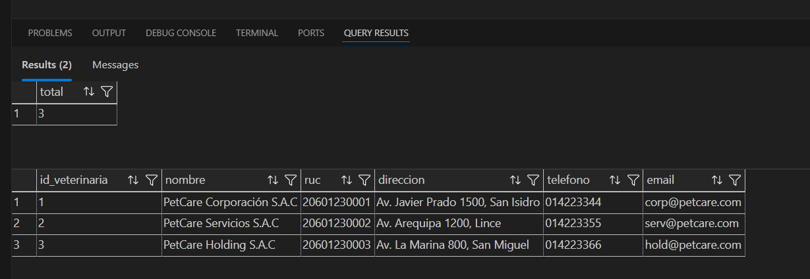

Evidencia2: Sede 

```sql

USE PETCARE_DB;
GO

SELECT COUNT(*) AS total FROM SEDE;
SELECT * FROM SEDE ORDER BY id_sede;
GO
```

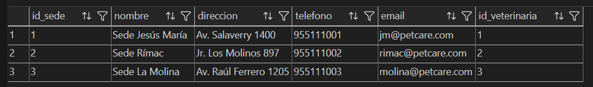

Evidencia3: Dueno

```sql

USE PETCARE_DB;
GO

SELECT COUNT(*) AS total FROM DUENO;
SELECT * FROM DUENO ORDER BY id_dueno;
GO
```

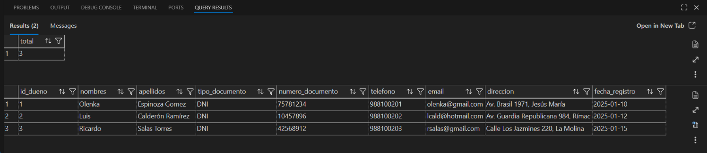

Evidencia4: Mascota

```sql

USE PETCARE_DB;
GO

SELECT COUNT(*) AS total FROM MASCOTA;
SELECT * FROM MASCOTA ORDER BY id_mascota;
GO
```

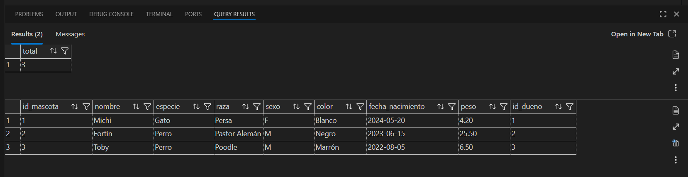

## 4.4 Consultas

### 4.4.1 Consultas para la base de datos relacional

*Consultas:*

**Historial de citas con datos completos**

**Responsable:** Jennifer Riveros

Esta consulta muestra el historial de citas incluyendo mascota, dueño, veterinario y sede donde atiende. Sirve para auditoría y seguimiento operativo.

```sql

USE PETCARE_DB;
GO

SELECT
    c.id_cita,
    c.fecha AS fecha_cita,
    c.estado,
    c.motivo,
    m.nombre AS mascota,
    m.especie,
    m.raza,
    (d.nombres + ' ' + d.apellidos) AS dueno,
    (v.nombres + ' ' + v.apellidos) AS veterinario,
    con.id_consulta,
    con.fecha AS fecha_consulta,
    s.nombre AS servicio,
    con.observaciones
FROM CITA c
JOIN MASCOTA m ON c.id_mascota = m.id_mascota
JOIN DUENO d ON m.id_dueno = d.id_dueno
JOIN VETERINARIO v ON c.id_veterinario = v.id_veterinario
LEFT JOIN CONSULTA con ON con.id_cita = c.id_cita
LEFT JOIN SERVICIO s ON con.id_servicio = s.id_servicio
ORDER BY c.fecha DESC;
```
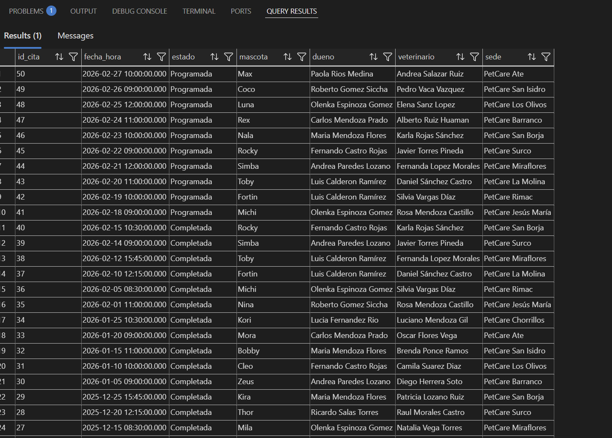

**Total de citas por veterinario**

**Responsable:** Jennifer Riveros

Esta consulta permite identificar qué servicios se realizan más y estimar ingresos sumando el costo del servicio por cada consulta registrada. Ayuda a analizar demanda y rendimiento.

```sql

USE PETCARE_DB;
GO

SELECT
  v.id_veterinario,
  v.nombres + ' ' + v.apellidos AS veterinario,
  COUNT(*) AS total_citas
FROM CITA c
JOIN VETERINARIO v ON v.id_veterinario = c.id_veterinario
GROUP BY v.id_veterinario, v.nombres, v.apellidos
ORDER BY total_citas DESC;
GO

```
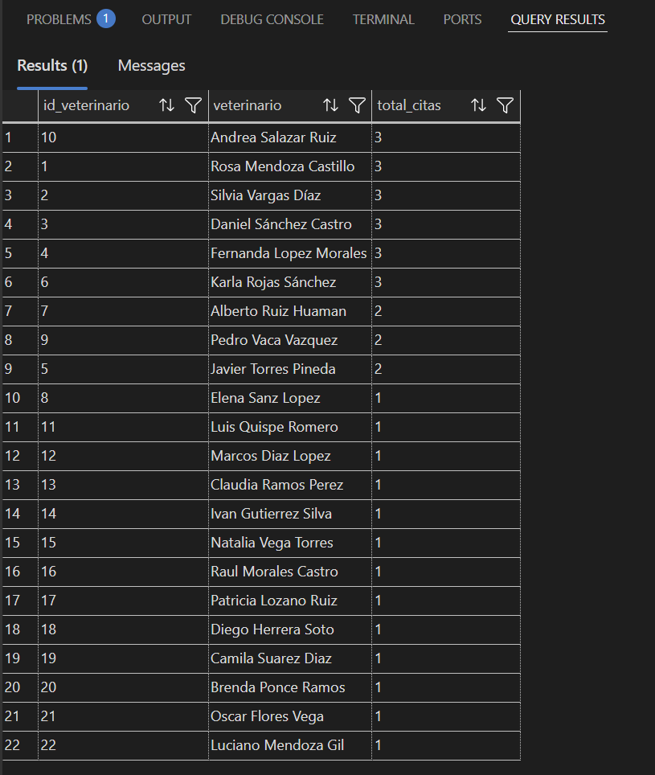

**Mascotas con contacto de emergencia del dueño**

**Responsable:** Jennifer Riveros

Esta consulta lista cada mascota con su dueño y el contacto de emergencia asociado al dueño. Es útil para atención rápida ante incidentes cuando el dueño no está disponible.

```sql
USE PETCARE_DB;
GO

SELECT
    m.nombre AS mascota,
    d.nombres + ' ' + d.apellidos AS dueno,
    ce.nombre AS contacto_emergencia,
    ce.telefono AS telefono_emergencia,
    ce.parentesco
FROM MASCOTA m
INNER JOIN DUENO d
    ON d.id_dueno = m.id_dueno
LEFT JOIN CONTACTO_EMERGENCIA ce
    ON ce.id_dueno = d.id_dueno
ORDER BY dueno, mascota;
GO
```
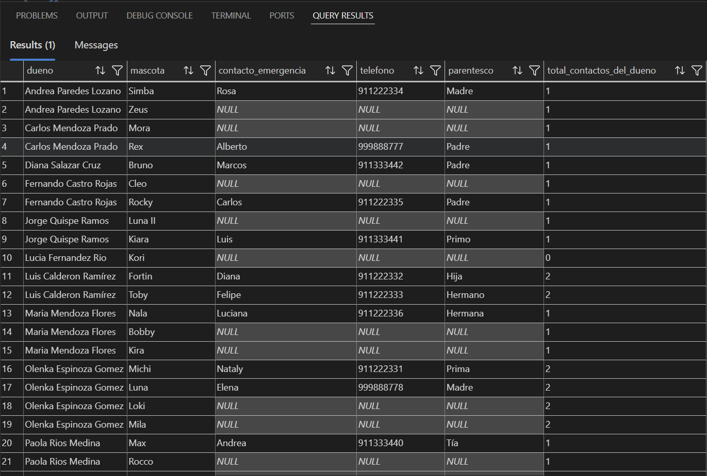

**Veterinarios por sede**

**Responsable:** Rose Vergaray

Esta consulta permite visualizar la distribución de los veterinarios en cada sede de la clínica veterinaria, mostrando información como el nombre de la sede, su dirección y los datos de contacto de cada profesional asignado. Además, incluye el cálculo del total de veterinarios por sede mediante una función de conteo, lo que facilita el análisis de la disponibilidad de personal y la organización administrativa dentro del sistema.

```sql

USE PETCARE_DB;
GO

SELECT 
    s.id_sede,
    s.nombre AS sede,
    s.direccion,
    v.id_veterinario,
    v.nombres + ' ' + v.apellidos AS veterinario,
    v.telefono,
    v.email,
    COUNT(v.id_veterinario) OVER(PARTITION BY s.id_sede) AS total_veterinarios_en_sede
FROM SEDE s
LEFT JOIN VETERINARIO v 
    ON v.id_sede = s.id_sede
ORDER BY s.nombre, veterinario;
GO

```
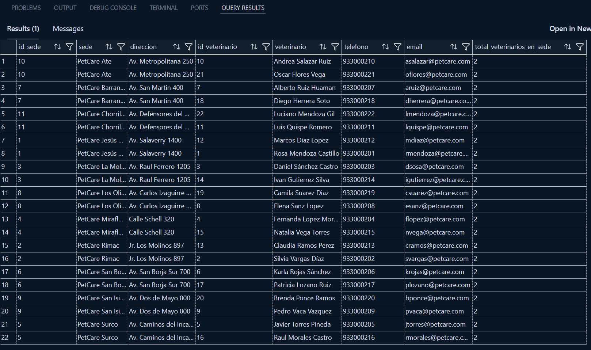

**Especialidades por veterinario**

**Responsable:** Rose Vergaray

Esta consulta tiene como objetivo identificar las especialidades médicas asociadas a cada veterinario. Muestra el nombre del veterinario, la sede donde labora y cada una de sus especialidades, permitiendo conocer las áreas de atención disponibles y optimizar la asignación de citas según el tipo de servicio requerido.

```sql

USE PETCARE_DB;
GO

SELECT 
    v.id_veterinario,
    v.nombres + ' ' + v.apellidos AS veterinario,
    s.nombre AS sede,
    e.nombre AS especialidad
FROM VETERINARIO v
INNER JOIN SEDE s 
    ON s.id_sede = v.id_sede
INNER JOIN VETERINARIO_ESPECIALIDAD ve 
    ON ve.id_veterinario = v.id_veterinario
INNER JOIN ESPECIALIDAD e 
    ON e.id_especialidad = ve.id_especialidad
ORDER BY veterinario, especialidad;
GO

```
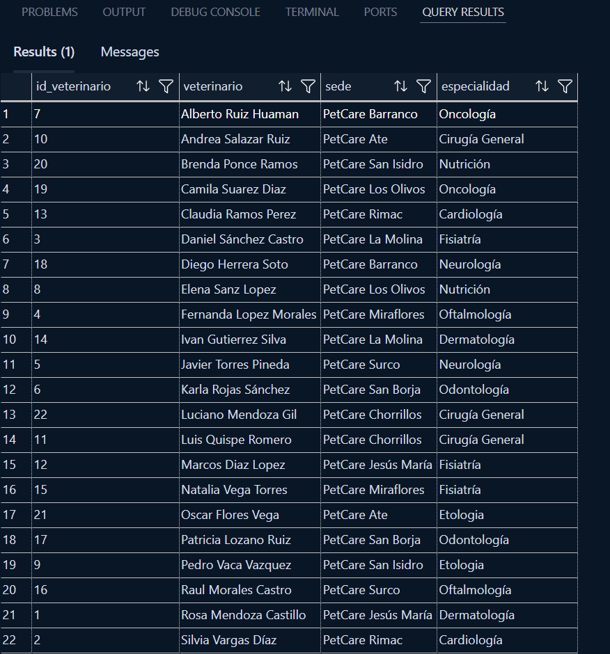

**Dueños con más de una mascota**

**Responsable:** Rose Vergaray

Esta consulta permite identificar a los dueños que tienen registradas dos o más mascotas en el sistema, agrupando la información y aplicando un filtro mediante la cláusula HAVING. Su objetivo es facilitar la gestión administrativa de propietarios con múltiples mascotas dentro de la clínica.

```sql

USE PETCARE_DB;
GO

SELECT 
    d.id_dueno,
    d.nombres + ' ' + d.apellidos AS dueno,
    d.telefono,
    d.email,
    COUNT(m.id_mascota) AS total_mascotas
FROM DUENO d
INNER JOIN MASCOTA m 
    ON m.id_dueno = d.id_dueno
GROUP BY 
    d.id_dueno,
    d.nombres,
    d.apellidos,
    d.telefono,
    d.email
HAVING COUNT(m.id_mascota) > 1
ORDER BY total_mascotas DESC;
GO

```
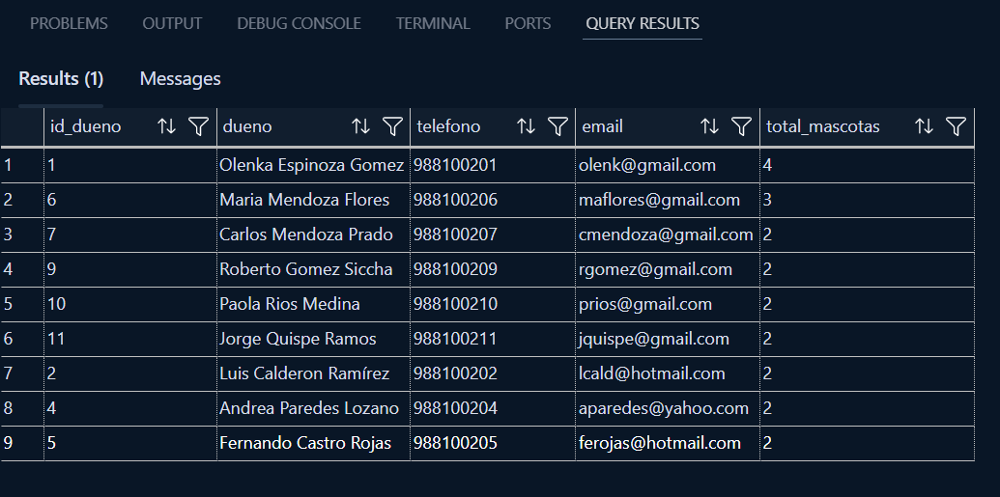

**Mascotas con más consultas en el último año**

**Respondable:** Judith Quispe

Se identifican pacientes frecuentes para evaluar su estado de salud y posibles problemas crónicos.

```sql
USE PETCARE_DB;
GO

SELECT TOP 10
    m.id_mascota,
    m.nombre AS mascota,
    d.nombres + ' ' + d.apellidos AS dueno,
    COUNT(c.id_consulta) AS total_consultas,
    MAX(c.fecha_hora) AS ultima_consulta
FROM MASCOTA m
INNER JOIN DUENO d ON m.id_dueno = d.id_dueno
INNER JOIN CONSULTA c ON m.id_mascota = c.id_mascota
WHERE c.fecha_hora >= DATEADD(year, -1, GETDATE())
GROUP BY m.id_mascota, m.nombre, d.nombres, d.apellidos
ORDER BY total_consultas DESC;
GO

```
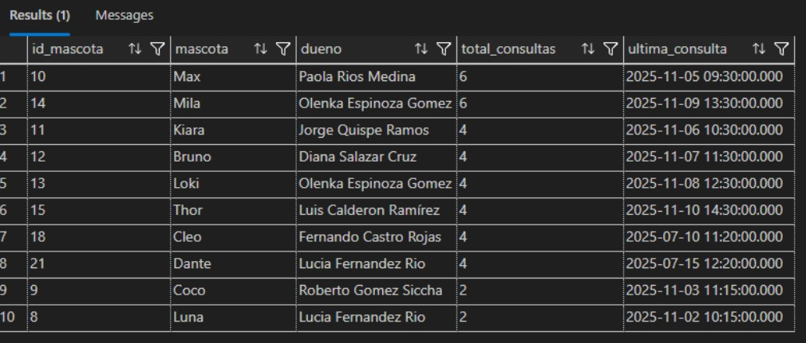

**Medicamentos más recetados con total de prescripciones**

**Respondable:** Judith Quispe

Busca controlar la demanda de medicamentos para planificar compras y evaluar patrones de tratamiento.

```sql
USE PETCARE_DB;
GO
SELECT
    me.nombre AS medicamento,
    me.descripcion,
    COUNT(rm.id_receta) AS veces_recetado,
    SUM(CAST(LEFT(rm.dosis, PATINDEX('%[^0-9]%', rm.dosis + ' ') - 1) AS INT)) AS unidades_aprox
FROM RECETA_MEDICAMENTO rm
INNER JOIN MEDICAMENTO me ON rm.id_medicamento = me.id_medicamento
GROUP BY me.id_medicamento, me.nombre, me.descripcion
ORDER BY veces_recetado DESC;
GO

```
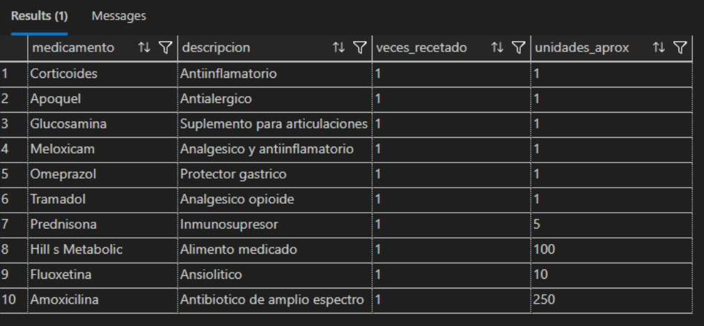

**Ocupación de áreas clínicas**

**Respondable:** Judith Quispe

Busca gestionar la capacidad de las áreas clínicas y conocer la ocupación actual.

```sql
USE PETCARE_DB;
GO
SELECT
    a.nombre AS area_clinica,
    s.nombre AS sede,
    a.capacidad,
    COUNT(h.id_hospitalizacion) AS pacientes_actuales,
    a.capacidad - COUNT(h.id_hospitalizacion) AS plazas_disponibles,
    STRING_AGG(m.nombre, ', ') AS mascotas_internadas
FROM AREA_CLINICA a
INNER JOIN SEDE s ON a.id_sede = s.id_sede
LEFT JOIN HOSPITALIZACION h ON a.id_area_clinica = h.id_area_clinica
    AND h.fecha_salida IS NULL  -- hospitalizaciones activas
LEFT JOIN MASCOTA m ON h.id_mascota = m.id_mascota
GROUP BY a.id_area_clinica, a.nombre, a.capacidad, s.nombre
ORDER BY pacientes_actuales DESC;
GO

```
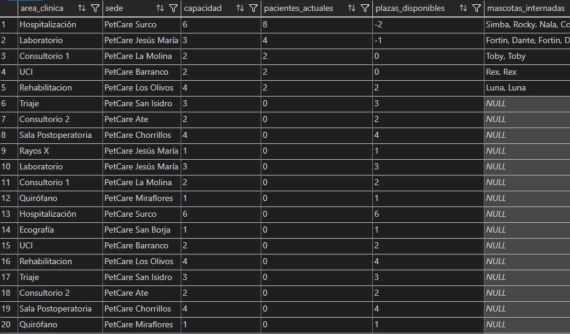

**Listado de mascotas y sus contactos de emergencia**

**Responsable:** Adriano Tintayo

Esta consulta es vital para la seguridad. Muestra el nombre de la mascota, su dueño y a quién llamar en caso de emergencia si el dueño no contesta.

```sql
USE PETCARE_DB;
GO
SELECT
    M.nombre AS Mascota,
    D.nombres AS Dueno,
    CE.nombre AS Contacto_Emergencia,
    CE.telefono AS Telefono_Emergencia,
    CE.relacion AS Parentesco
FROM MASCOTA M
INNER JOIN DUENO D ON M.id_dueno = D.id_dueno
INNER JOIN CONTACTO_EMERGENCIA CE ON M.id_mascota = CE.id_mascota;
GO

```
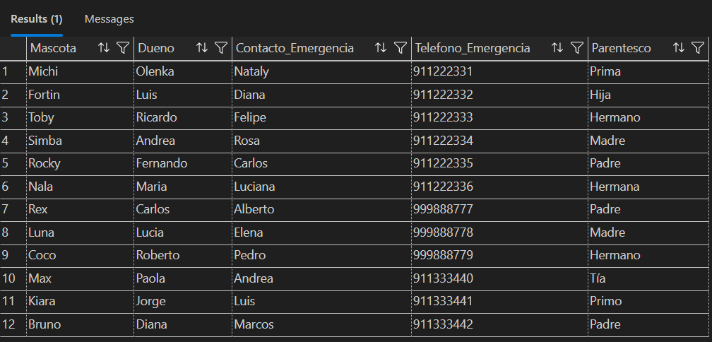

**Sedes con más consultas realizadas**

**Responsable:** Adriano Tintayo

Esta consulta ayuda a saber qué sede tiene más movimiento. Une las consultas con los veterinarios y sus sedes asignadas.

```sql
USE PETCARE_DB;
GO
SELECT
    S.nombre AS Nombre_Sede,
    COUNT(C.id_consulta) AS Total_Consultas
FROM CONSULTA C
INNER JOIN VETERINARIO V ON C.id_veterinario = V.id_veterinario
INNER JOIN SEDE S ON V.id_sede = S.id_sede
GROUP BY S.nombre
ORDER BY Total_Consultas DESC;
GO

```
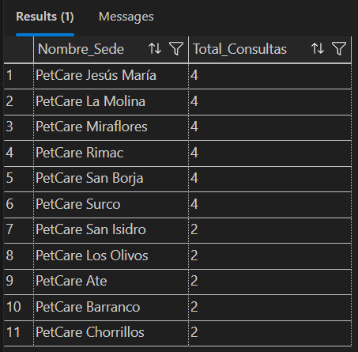

**Resumen de ingresos por tipo de servicio**

**Responsable:** Adriano Tintayo

Permite ver cuánto dinero se ha generado por cada tipo de servicio (Vacunación, Cirugía, etc.) registrado en las sedes.

```sql
USE PETCARE_DB;
GO
SELECT
    nombre AS Tipo_Servicio,
    SUM(costo) AS Ingresos_Totales
FROM SERVICIO
GROUP BY nombre;
GO

```
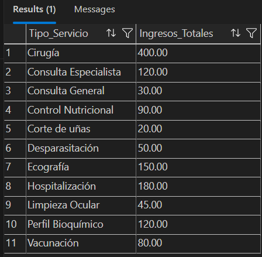

*Procedimientos:*

**Historial clínico de una mascota por parámetro**

**Responsable:**

**Consultar citas programadas por veterinario**

**Responsable:** Adriano Tintayo

Este procedimiento te servirá para que un veterinario vea qué mascotas tiene que atender en un día específico.

```sql

USE PETCARE_DB;
GO

CREATE OR ALTER PROCEDURE usp_agenda_veterinario_dia
    @id_vet INT,
    @fecha_busqueda DATE
AS
BEGIN
    SET NOCOUNT ON;


    SELECT
        C.fecha_hora AS Fecha_Hora,
        M.nombre AS Nombre_Mascota,
        M.especie AS Especie,
        D.nombres AS Nombre_Dueno,
        D.apellidos AS Apellido_Dueno,
        C.motivo AS Motivo_Cita,
        C.estado AS Estado_Cita
    FROM CITA C
    INNER JOIN MASCOTA M ON C.id_mascota = M.id_mascota
    INNER JOIN DUENO D ON M.id_dueno = D.id_dueno
    WHERE C.id_personal = @id_vet
      AND CAST(C.fecha_hora AS DATE) = @fecha_busqueda
    ORDER BY C.fecha_hora ASC;
END;
GO


EXEC usp_agenda_veterinario_dia @id_vet = 1, @fecha_busqueda = '2025-08-15';
GO

```
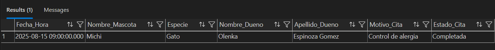

**Generar recordatorios de vacunas próximas**

**Responsable:** Judith Quispe

Busca automatizar la generación de recordatorios para dueños de mascotas cuyas vacunas están por vencer en los próximos días. Este procedimiento puede ser ejecutado diariamente por un job para enviar alertas.

```sql

USE PETCARE_DB;
GO

DROP PROCEDURE IF EXISTS sp_generator_recordatorios_vacunas;
GO

CREATE PROCEDURE sp_generator_recordatorios_vacunas
    @dias_anticipacion INT = 15
AS
BEGIN
    SET NOCOUNT ON;


    SELECT
        m.id_mascota,
        m.nombre AS mascota,
        d.nombres + ' ' + d.apellidos AS dueno,
        d.telefono,
        d.email,
        v.nombre AS vacuna,
        mv.proxima_dosis,
        DATEDIFF(day, GETDATE(), mv.proxima_dosis) AS dias_restantes,
        CASE
            WHEN DATEDIFF(day, GETDATE(), mv.proxima_dosis) <= 0 THEN 'VENCIDA'
            WHEN DATEDIFF(day, GETDATE(), mv.proxima_dosis) <= 3 THEN 'URGENTE'
            WHEN DATEDIFF(day, GETDATE(), mv.proxima_dosis) <= 7 THEN 'PRÓXIMA'
            ELSE 'PENDIENTE'
        END AS prioridad
    FROM MASCOTA_VACUNA mv
    INNER JOIN MASCOTA m ON mv.id_mascota = m.id_mascota
    INNER JOIN DUENO d ON m.id_dueno = d.id_dueno
    INNER JOIN VACUNA v ON mv.id_vacuna = v.id_vacuna
    WHERE mv.proxima_dosis BETWEEN GETDATE() AND DATEADD(day, @dias_anticipacion, GETDATE())
       OR mv.proxima_dosis < GETDATE()
    ORDER BY mv.proxima_dosis;
END;
GO

EXEC sp_generator_recordatorios_vacunas;  -- 15 días por defecto
GO

```
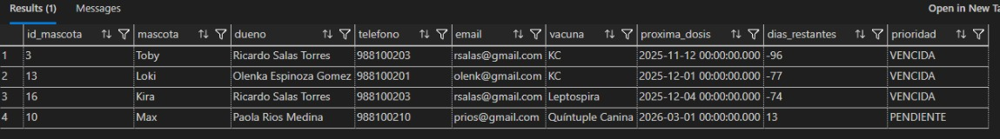

*Funciones:*

**Atenciones por veterinario**

**Responsable:** Rose Vergaray

Esta función con retorno de tabla tiene como finalidad mostrar las atenciones realizadas por un veterinario específico, incluyendo su nombre, la sede donde labora, la mascota atendida y la fecha de cada consulta registrada. Su objetivo es facilitar el seguimiento de las actividades médicas realizadas por el personal veterinario, contribuyendo al control operativo y a la gestión interna dentro del sistema de la clínica.

```sql

USE PETCARE_DB;
GO

CREATE OR ALTER FUNCTION fn_detalle_atenciones_veterinario
(
    @id_veterinario INT
)
RETURNS TABLE
AS
RETURN
(
    SELECT 
        v.id_veterinario,
        v.nombres + ' ' + v.apellidos AS veterinario,
        s.nombre AS sede,
        m.nombre AS mascota,
        c.fecha_hora
    FROM CONSULTA c
    INNER JOIN VETERINARIO v
        ON v.id_veterinario = c.id_veterinario
    INNER JOIN SEDE s
        ON s.id_sede = v.id_sede
    INNER JOIN MASCOTA m
        ON m.id_mascota = c.id_mascota
    WHERE v.id_veterinario = @id_veterinario
);
GO
--- Ejemplo de uso:
SELECT * 
FROM dbo.fn_detalle_atenciones_veterinario(12);

```
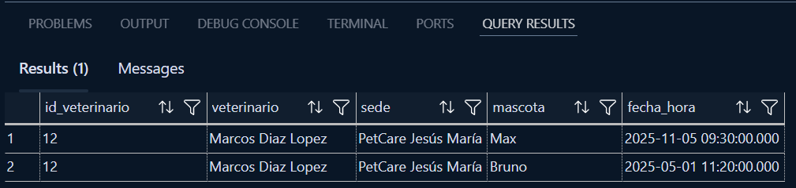


<div style="page-break-after: always"></div>

# BIBLIOGRAFÍA

Gadgerss. (2025, 15 de mayo). *Las tres principales brechas tecnológicas que frenan a las MyPEs peruanas*. Gadgerss. https://gadgerss.com/2025/05/15/las-tres-principales-brechas-tecnologicas-que-frenan-a-las-mypes-peruanas/

Ballarin, C. (2019). *Casi la mitad de hogares peruanos tienen una mascota*. Kantar. https://www.kantar.com/latin-america/inspiracion/consumo-masivo/hogares-con-mascotas

# ANEXOS
- Repositorio en GitHub: [PetCare-proyecto](https://github.com/DataSystem-organization/PetCare-proyecto/tree/main)
- Carpeta de archivos: [Google Drive](https://drive.google.com/drive/folders/1ysx7GtMfmhUFN9xITfBEGoUvXDckLpa5?usp=sharing)
- Link de video del TP1: [Microsoft Stream](https://upcedupe-my.sharepoint.com/:v:/g/personal/u20241d159_upc_edu_pe/IQAxszfRY13hTYbBz2s3MiheATb0fIbwlpVDa8kWcb60vAI?e=RQgzfJ&nav=eyJyZWZlcnJhbEluZm8iOnsicmVmZXJyYWxBcHAiOiJTdHJlYW1XZWJBcHAiLCJyZWZlcnJhbFZpZXciOiJTaGFyZURpYWxvZy1MaW5rIiwicmVmZXJyYWxBcHBQbGF0Zm9ybSI6IldlYiIsInJlZmVycmFsTW9kZSI6InZpZXcifX0%3D)
[Youtube](https://youtu.be/G5ZFKfJF7Us)